# QC guide

Here are guidelines to QC each pipeline results.

## fmriprep
### Anatomical Scans
**Things to check:**
1) Good BET (Brain Extraction Tool) Segmentation:
    * Red outline (skullstrip) doesn’t include skull, outlines the brain
    * Blue outline traces white matter area (lighter parts of brain)
  
      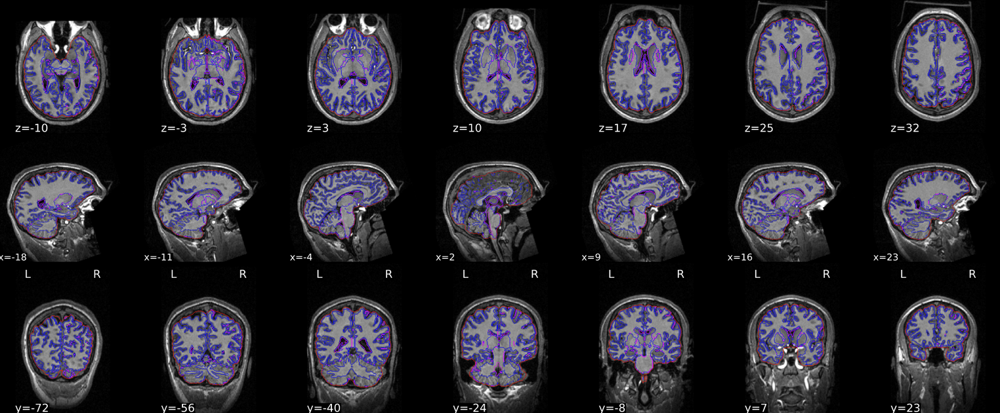

  
2) Good MNI wrap:
   * “Participant” brain only includes brain (no skull being included)
   * Make sure that the brain isn’t being stretched down into the cerebellum (indicative of BET segmentation issue)
  
     
 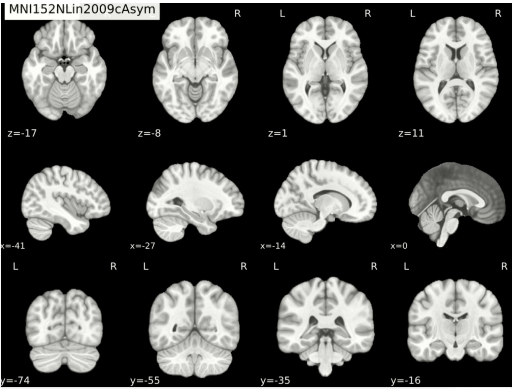

   
### Functional Scans
**Things to check:**
1) Good EPI to T1 alignment:
    * The red/blue outlines should align with the functional image (darker/fuzzier image)
    * Bright white parts of the functional image should be mostly excluded from the red/blue outline
  
 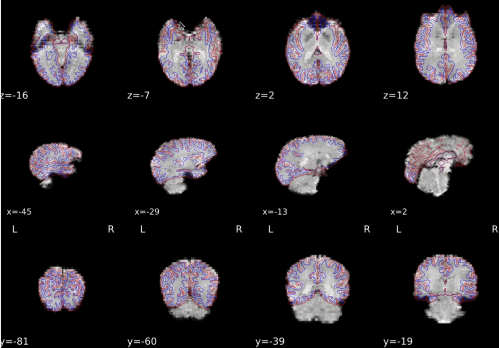

  
2) Good SDC correction:

The “After” Image should more closely align with the blue outline than the “Before” image

   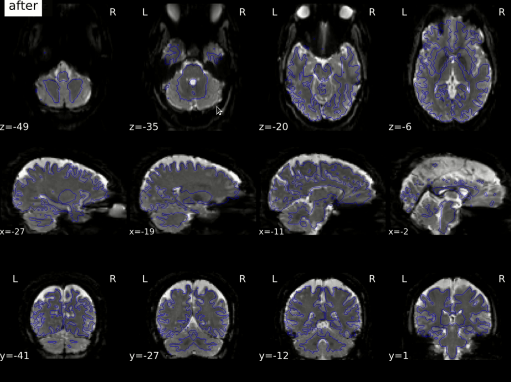

3) Clipping:

In some cases the bottom part of the cerebellum gets clipped, this is acceptable (a pass) but should still be annotated as having a Clipping issue. However, if any part of the cortex itself is clipped (bottom or top) this rating should always result in a fail.

    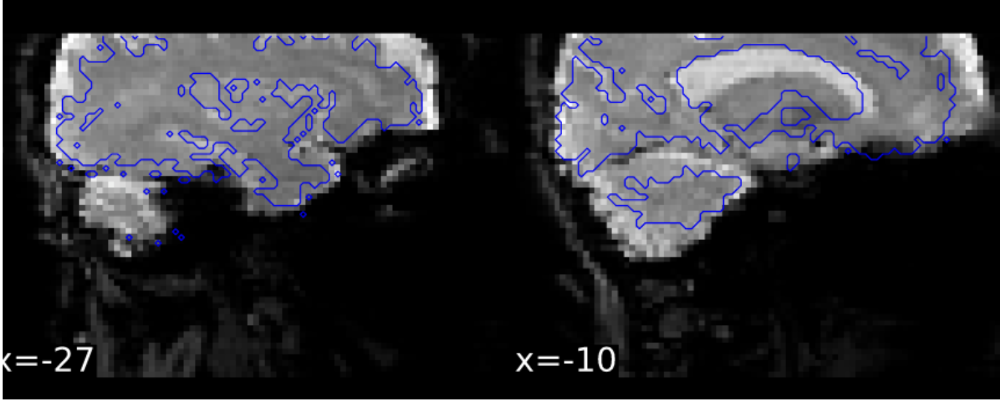

4) EPI signal dropout:

Large signal dropout in the EPI image but not in the T1, which should always result in a Fail.

    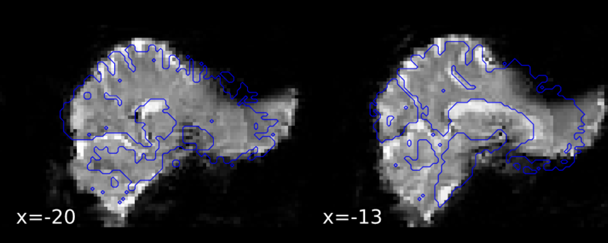

      
## qsiprep

**Things to check:**

1) Good motion and distortion corrected DWI file:
   
This is the final image output of the pipeline, so it has been motion corrected, denoised, bias corrected, etc. So, this is the first image you should be checking to see if anything went wrong with those steps, namely if it has been distorted too much, cut off, etc. In this case, the images clearly resemble the shape of a brain and there are little to no artifacts visible outside of the brain.

   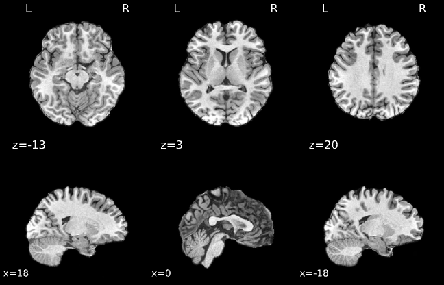
    
2) Good framewise displacement graph:

The y axis has a relatively low maximum value, indicating overall lower levels of motion. The two traces do not significantly diverge from each other, with generally similar peaks and troughs.

   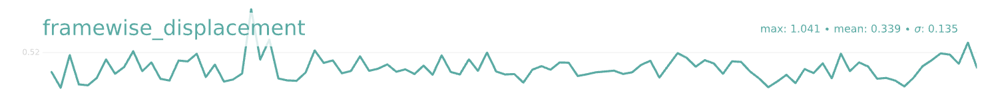
    
3) Good Q-space sampling:
   
Compare the two images by rotating the images around and ensuring that they both generally make out the shape of a ball as seen below.

   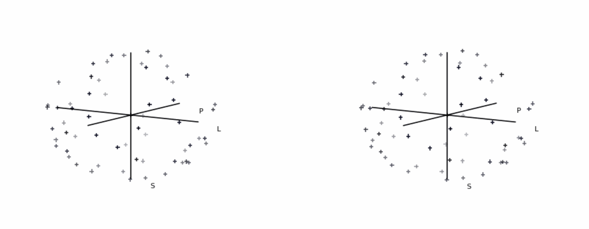
    
4) Good brain mask:
   
The brain mask creates a clear outline of the brain, with no significant deviations. Ensure to scroll through each of the sections, ensuring that the brain mask has correctly registered to the brain’s shape at each slice.

 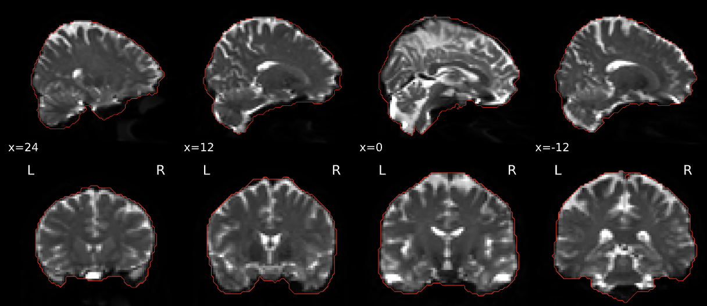
    
    
5) Good Tensor image:
    
Each of the different directions as indicated by the different colors need to be localized to their own locations and discernible from each other. For example the sagittal section shows a clear separation between the green and red tracts.

   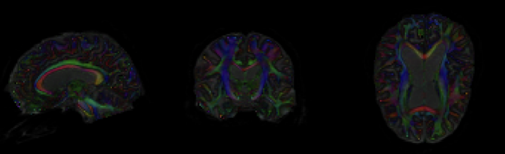
    
## ciftify

**Things to check:**

1) Make sure there is no black images, which happens if recon-all failed very early in the pipeline.

 
 
2) Aparc image (examples of QC fails):

* check the quality of image. For a very poor quality anatomical, the surface will look shrivelled up like the example below.

 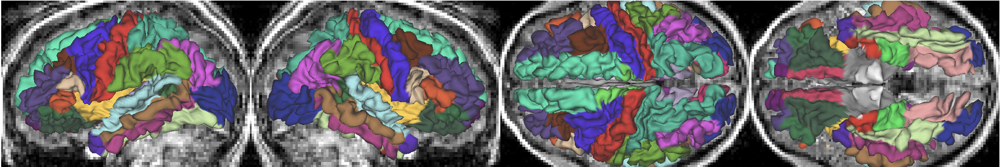
 
* If the gray matter is missing part of the occipital lobe, the back of the brain will look split apart on the bottom view (far right).

 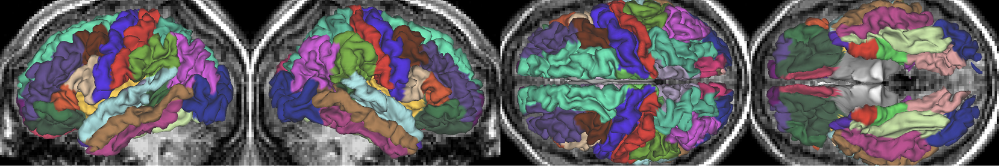
 
* For this participant, the surface reconstruction in the aparc view looks jagged (especially in the orbital frontal cortex).

 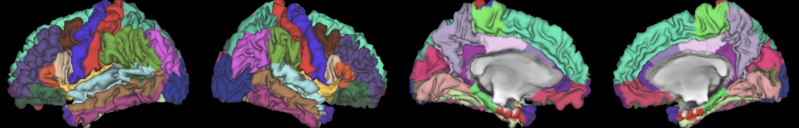
 
3) White and pial surfaces:

 A key place to look are the two temporal poles. Surface reconstruction in these area can fail. Here is an example:

 
 
