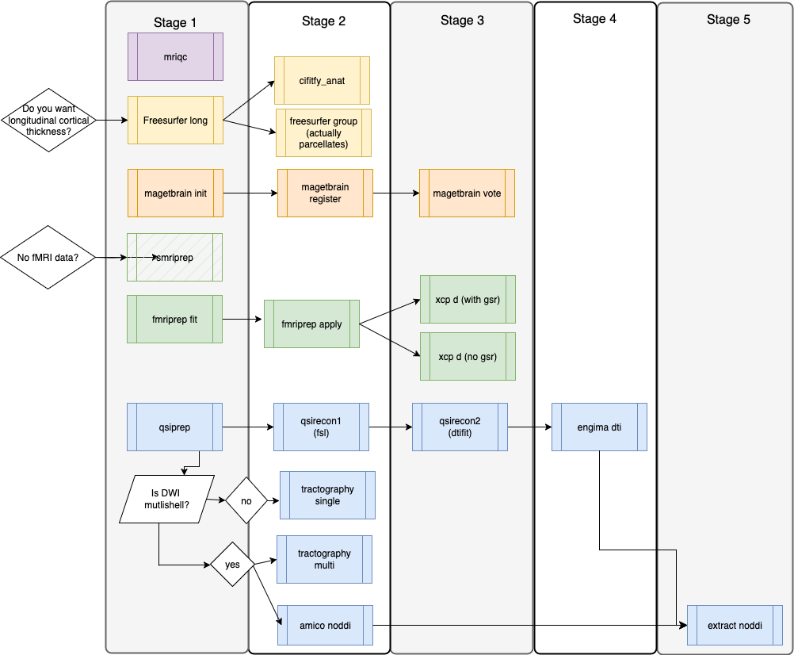

# SCanD_project

This is a base repo for the Schizophrenia Canadian Neuroimaging Database (SCanD) codebase. It is meant to be forked/cloned for every SCanD dataset.



General folder structure for the repo (when all is run):

```
${BASEDIR}
├── code                         # a clone of this repo
│   └── ...    
├── containers                   # the singularity images are copied or linked to here
│   ├── fmriprep-23.2.3.simg
│   ├── mriqc-24.0.0.simg
│   ├── qsiprep-0.22.0.sif
│   ├── freesurfer-6.0.1.simg
│   ├── fmriprep_ciftity-v1.3.2-2.3.3.simg
│   ├── magetbrain.sif
│   ├── nipoppy.sif
│   ├── tbss_2023-10-10.simg
│   └── xcp_d-0.7.3.simg
├── data
│   ├── local                    # folder for the "local" dataset
│   │   ├── bids                 # the defaced BIDS dataset
│   │   ├── derivatives
│   │   │   ├── ciftify          # ciftify derivatives
│   │   │   ├── fmriprep         # fmriprep derivatives
│   │   │   ├── freesurfer       # freesurfer derivative
│   │   │   ├── MAGeTbrain       # MAGETbrain input and output folders
│   │   │   ├── mriqc            # mriqc derivatives
│   │   │   ├── qsiprep          # qsiprep derivatives
│   │   │   ├── smriprep         # smriprep derivatives
│   │   │   ├── xcp_d            # xcp with GSR
│   │   │   └── xcp_noGSR        # xcp with GSR removed
│   │   │  
│   │   ├── dtifit               # dtifit
│   │   ├── enigmaDTI            # enigmadti
│   │   ├── qsiprep            
│   │   ├── qsirecon             # qsirecon derivatives
│   │   └── qsirecon-FSL         # step1 qsirecon
│   |
│   └── share                    # folder with a smaller subset ready to share
│       ├── amico_noddi          # contains only qc images and metadata
│       ├── ciftify              # contains only qc images and metadata
│       ├── enigmaDTI            # enigmaDTI
│       ├── fmriprep             # contains only qc images and metadata
│       ├── freesurfer_group     # contains tsv files of group data
│       ├── magetbrain           # fusion folder
│       ├── mriqc                # contains only qc images and metadata
│       ├── qsiprep              # contains only qc images and metadata
│       ├── smriprep             # contains only qc images and metadata
│       ├── tractify             # contains connectivity.mat file
│       ├── xcp-d                # contains xcp results with GSR
│       └── xcp_noGSR            # contains xcp results with GSR              
|── LICENSE
├── logs               # logs from jobs run on cluster           
|── Neurobagel
|── project_id
|── QC guide.md
|── Quick_start_workflow automation.md
|── README.md
|── share_folder.md
|──stage_1.sh
|──stage_2.sh
|──stage_3.sh
|──stage_4.sh
|──stage_5.sh
|──stage_6.sh
└── templates                  # an extra folder with pre-downloaded fmriprep templates (see setup section)
    └── parcellations
        ├── README.md
        |── tpl-fsLR_res-91k_atlas-Glasser_dseg.dlabel.nii
        └── ...  #and 13 other atlases
```

Currently this repo is going to be set up for running things on SciNet Cedar cluster - but we can adapt later to create local set-ups behind hospital firewalls if needed.

# The general overview of what to do

| stage |  #	| Step	|   How Long Does it take to run? 	|
|---    |---	|---	|---	|
| stage 0|   0a	|  [Setting up the SciNet environment](#Setting-your-scinet-environment-and-prepare-dataset)	| 30 minutes in terminal 	|
|^ |  0b	|  [Organize your data into BIDS](#organize-your-data-into-bids) 	|   As long as it takes	|
|^ |  0c	|  [Deface the BIDS data (if not done during step 1)](#deface-the-bids-data-if-not-done-during-step-1) 	|   	|
|^ |  0d	|  [Move you bids data to the correct place and add lables to participants.tsv file](#Put-your-bids-data-into-the-datalocal-folder-and-add-lables-to-participantstsv-file)	| depends on time to transfer data to SciNet | 
|^ |   0e	|  [Initializing nipoppy trackers](#Initializing-nipoppy-trackers)	| 2 minutes in terminal 	|
|^ |   0f	|  [Edit fmap files](#Edit-fmap-files)	| 2 minutes in terminal 	|
|stage 1|   01a	|  [Run MRIQC](#Running-mriqc) 	|  8 hours on slurm 	|
|^ |  01b	|  [Run QSIprep](#Running-qsiprep) 	|   6 hours on slurm	|
|^|   01c	|  [Run freesurfer](#Running-freesurfer) 	|   23 hours on slurm	|
|^|   01d	|  [Run fMRIprep fit](#Running-fmriprep-fit-includes-freesurfer) 	|   16 hours on slurm	|
|^ |  01e	|  [Run smriprep](#Running-smriprep) 	|   10 hours on slurm	|
|^ |  01f	|  [Run magetbrain-init](#Running-magetbrain-init) 	|   1 hours on slurm	|
|^ |  01g	|  [Check tsv file](#Check-tsv-file) 	|    	|
|stage 2|   02a	|  [Run fMRIprep apply](#Running-fmriprep-apply) 	|  3 hours of slurm 	|
|^ |   02b	|  [Run freesurfer group analysis](#Running-freesurfer-group-analysis) 	|  6 hour of slurm 	|
|^ |   02c	|  [Run ciftify-anat](#Running-ciftify-anat) 	|  3 hours on slurm 	|
|^ |   02d	|  [Run qsirecon step1](#Running-qsirecon-step1) 	|  20 min of slurm 	|
|^ |   02e  |  [Run amico noddi](#Running-amico-noddi) | 2 hours of slurm |
|^ |   02f	|  [Run tractography](#Running-tractography) 	|  12 hour of slurm 	|
|^ |   02g	|  [Run magetbrain-register](#Running-magetbrain-register) 	|  24 hours on slurm 	|
|^ |   02h  |  [Check tsv file](#Check-tsv-file) 	|    	|
|stage 3 |  03a	|  [Run xcp-d](#Running-xcp-d) 	|  5 hours on slurm  |
|^ |   03b  |  [Run xcp-noGSR](#Running-xcp-noGSR) 	|  5 hours on slurm  |
|^ |   03c  |   [Run qsirecon step2](#Running-qsirecon-step2) 	|  1 hour of slurm 	|
|^ |   03f	|  [Run magetbrain-vote](#Running-magetbrain-vote) 	|  10 hours on slurm 	|
|^ |   03g	|  [Check tsv file](#Check-tsv-file) 	|    	|
|stage 4 |  04a |  [Run enigma-dti](#Running-enigma-dti) 	|  1 hours on slurm	| 
|^ |   04b	|  [Check tsv file](#Check-tsv-file) 	|    	|
|stage 5 |  05a |  [Run extract-noddi](#Running-extract-noddi) 	|  3 hours on slurm	|
|^ |   05b	|  [Check tsv file](#Check-tsv-file) 	|    	|
|stage 6 |   06a	|  [Run extract and share to move to data to sharable folder](#Syncing-the-data-to-the-share-directory) 	|   8 hours on slurm	|

# Setting your SciNet environment and prepare dataset

## Setting Scinet Environment

### Cloning this Repo

Each study should be kept in a **separate `SCanD_project` folder** to prevent overwriting or mixing data between studies.

Before starting a new study:
- Either **rename** the existing `SCanD_project` folder (e.g., `SCanD_project_study1`),  
- Or **move** it elsewhere before cloning the repository again.

```sh
cd $SCRATCH
git clone -b Cedar --single-branch https://github.com/TIGRLab/SCanD_project.git
```

### Run the software set-up script

```sh
cd ${SCRATCH}/SCanD_project
source code/00_setup_data_directories.sh
```

## Organize your data into BIDS

This is the longest - most human intensive - step. But it will make everything else possible! BIDS is really a naming convention for your MRI data that will make it easier for other people in the consortium (as well as the software/ pipeline that you are using) to understand what your data is (e.g. what scan types, how many participants, how many sessions). Converting your data into BIDS may require some renaming and reorganizing. No coding is required, but there are now a lot of different software projects out there to help with the process.

For amazing tools and tutorials for learning how to BIDS convert your data, check out the [BIDS starter kit](https://bids-standard.github.io/bids-starter-kit/).


### Deface the BIDS data (if not done during step 1)

A useful tool is [this BIDSonym BIDS app](https://peerherholz.github.io/BIDSonym/).


### Put your bids data into the data/local folder and add labels to participants.tsv file

We want to put your data into:

```
./data/local/bids
```
You can do this by either copying "scp -r", linking `ln -s` or moving the data to this place - it's your choice.
If you are copying data from another computer or server, you should use the SciNet datamover (dm) node, not the login node!

To switch into the dm node: 
```sh
ssh <cc_username>@cedar.computecanada.ca
rsync -av <local_server>@<local_server_address>:/<local>/<server>/<path>/<bids> ${SCRATCH}/SCanD_project/data/local/
```

To link existing data from another location on SciNet Cedar to this folder:

```sh
ln -s /your/data/on/scinet/bids ${SCRATCH}/SCanD_project/data/local/bids
```

After organizing the bids folder, proceed to populate the participant labels, such as 'sub-CMH0047' within the 'ScanD_project/data/local/bids/participants.tsv' file. First row should be "participant_id" and then you have all the subject ids in the other rows.

For example:
```bash
participant_id
sub-CMH00000005
sub-CMH00000007
sub-CMH00000012
```
Also, make sure dataset_description.json exists inside your bids folder.

### Initializing nipoppy trackers

In this step, we initialize the [nipoppy trackers](https://nipoppy.readthedocs.io/en/0.2.1/index.html) and set up a folder structure based on the nipoppy directory specification:

```sh
cd ${SCRATCH}/SCanD_project
source code/00_nipoppy_trackers.sh
```

### Edit fmap files

In some cases dcm2niix conversion fails to add "IntendedFor" in the fmap files which causes errors in fmriprep_apply step. Therefore, we need to edit fmap file in the bids folder and add "intendedFor"s. In order to edit these files we need to run a python code.

```sh
## First load a python module
module load python/3.11.5

## Create a directory for virtual environments if it doesn't exist
mkdir ~/.virtualenvs
cd ~/.virtualenvs
virtualenv --system-site-packages ~/.virtualenvs/myenv

## Activate the virtual environment
source ~/.virtualenvs/myenv/bin/activate 

python3 -m pip install bids

cd $SCRATCH/SCanD_project

python3 code/fmap_intended_for.py
```

In case you want to backup your json files before editing them:

```sh
mkdir bidsbackup_json
rsync -zarv  --include "*/" --include="*.json" --exclude="*"  data/local/bids  bidsbackup_json
```


# Quick Start - Workflow Automation

After setting up the scinet environment and organizing your BIDS folder and `participants.csv` file, instead of running each pipeline separately, you can run the codes for each stage simultaneously. For a streamlined approach to running pipelines by stages, please refer to the [Quick start workflow automation.md](Quick_start_workflow_automation.md) document and proceed accordingly. Otherwise, run pipelines separately.

* Note: if you are running xcp-d pipeline (stage 3) for the first time, just make sure to run the codes to download the templateflow files before running the automated codes. You can find these codes below in [xcp-d](#Running-xcp-d) section.


# Running Pipelines and sharing results

## Running mriqc

```sh
## go to the repo and pull new changes
cd ${SCRATCH}/SCanD_project
git pull         #in case you need to pull new code

## calculate the length of the array-job given
SUB_SIZE=1
N_SUBJECTS=$(( $( wc -l ./data/local/bids/participants.tsv | cut -f1 -d' ' ) - 1 ))
array_job_length=$(echo "$N_SUBJECTS/${SUB_SIZE}" | bc)
echo "number of array is: ${array_job_length}"


## submit the array job to the queue
sbatch --array=0-${array_job_length} ./code/01_mriqc_scinet.sh
```

## Running freesurfer

```sh
## go to the repo and pull new changes
cd ${SCRATCH}/SCanD_project
git pull         #in case you need to pull new code

## calculate the length of the array-job given
SUB_SIZE=1
N_SUBJECTS=$(( $( wc -l ./data/local/bids/participants.tsv | cut -f1 -d' ' ) - 1 ))
array_job_length=$(echo "$N_SUBJECTS/${SUB_SIZE}" | bc)
echo "number of array is: ${array_job_length}"


## submit the array job to the queue
sbatch --array=0-${array_job_length} ./code/01_freesurfer_long_scinet.sh
```

## Running fmriprep fit (includes freesurfer)

Note -  the script enclosed uses some interesting extra options:
 - it defaults to running all the fmri tasks - the `--task-id` flag can be used to filter from there
 - it is running `synthetic distortion` correction by default - instead of trying to work with the datasets available fieldmaps - because fieldmaps correction can go wrong - but this does require that the phase encoding direction is specified in the json files (for example `"PhaseEncodingDirection": "j-"`).

```sh
## go to the repo and pull new changes
cd ${SCRATCH}/SCanD_project
git pull         #in case you need to pull new code

## calculate the length of the array-job given
SUB_SIZE=1
N_SUBJECTS=$(( $( wc -l ./data/local/bids/participants.tsv | cut -f1 -d' ' ) - 1 ))
array_job_length=$(echo "$N_SUBJECTS/${SUB_SIZE}" | bc)
echo "number of array is: ${array_job_length}"

## submit the array job to the queue
sbatch --array=0-${array_job_length} code/01_fmriprep_fit_scinet.sh
```
## Running qsiprep

```sh
## go to the repo and pull new changes
cd ${SCRATCH}/SCanD_project
git pull

## figuring out appropriate array-job size
SUB_SIZE=1 
N_SUBJECTS=$(( $( wc -l ./data/local/bids/participants.tsv | cut -f1 -d' ' ) - 1 ))
array_job_length=$(echo "$N_SUBJECTS/${SUB_SIZE}" | bc)
echo "number of array is: ${array_job_length}"

## submit the array job to the queue
sbatch --array=0-${array_job_length} ./code/01_qsiprep_scinet.sh
```
## Running smriprep
If you want to only run structural data, you will need this pipeline. Otherwise, skip this pipeline.

```sh
## go to the repo and pull new changes
cd ${SCRATCH}/SCanD_project
git pull

## figuring out appropriate array-job size
SUB_SIZE=1 
N_SUBJECTS=$(( $( wc -l ./data/local/bids/participants.tsv | cut -f1 -d' ' ) - 1 ))
array_job_length=$(echo "$N_SUBJECTS/${SUB_SIZE}" | bc)
echo "number of array is: ${array_job_length}"

## submit the array job to the queue
sbatch --array=0-${array_job_length} ./code/01_smriprep_scinet.sh
```

## Running magetbrain init

#### Adding Age and Gender for Template Selection

The `01_magetbrain_init_scinet.sh` script selects **20 template files** based on the `data/local/bids/participants_demographic.tsv` file.  

To customize the selection, create a new TSV file named `participants_demographic.tsv`, which is a copy of `participants.tsv` but with two additional columns:  
- **Column 2:** Age  
- **Column 3:** Gender  

If `participants_demographic.tsv` is not provided, the script will randomly select 20 subjects.  

#### Changing Atlas Labels  
By default, the labels in `data/local/derivatives/MAGeTbrain/magetbrain_data/input/atlases/label` are based on **hippocampus** segmentation.  

To change the segmentation to **cerebellum, amygdala, or another region**:  
1. Remove existing labels:  
   ```bash
   rm data/local/derivatives/MAGeTbrain/magetbrain_data/input/atlases/label/*
2. Copy the desired labels from the shared directory:
   ```bash
   cp /scratch/arisvoin/shared/templateflow/atlases_all4/labels/* data/local/derivatives/MAGeTbrain/magetbrain_data/input/atlases/label/

### Run the pipeline:
```sh
## go to the repo and pull new changes
cd ${SCRATCH}/SCanD_project
git pull

## submit the array job to the queue
sbatch  ./code/01_magetbrain_init_scinet.sh
```

## Running fmriprep apply 

Note -  the script enclosed uses some interesting extra options:
 - it defaults to running all the fmri tasks - the `--task-id` flag can be used to filter from there
 - it is running `synthetic distortion` correction by default - instead of trying to work with the datasets available fieldmaps - because fieldmaps correction can go wrong - but this does require that the phase encoding direction is specificed in the json files (for example `"PhaseEncodingDirection": "j-"`).

```sh
## go to the repo and pull new changes
cd ${SCRATCH}/SCanD_project
git pull

## figuring out appropriate array-job size
SUB_SIZE=1 
N_SUBJECTS=$(( $( wc -l ./data/local/bids/participants.tsv | cut -f1 -d' ' ) - 1 ))
array_job_length=$(echo "$N_SUBJECTS/${SUB_SIZE}" | bc)
echo "number of array is: ${array_job_length}"

## submit the array job to the queue
sbatch --array=0-${array_job_length} ./code/02_fmriprep_apply_scinet.sh
```


## Running qsirecon step1

```sh
## go to the repo and pull new changes
cd ${SCRATCH}/SCanD_project
git pull

## figuring out appropriate array-job size
SUB_SIZE=1 
N_SUBJECTS=$(( $( wc -l ./data/local/bids/participants.tsv | cut -f1 -d' ' ) - 1 ))
array_job_length=$(echo "$N_SUBJECTS/${SUB_SIZE}" | bc)
echo "number of array is: ${array_job_length}"

## submit the array job to the queue
sbatch --array=0-${array_job_length} ./code/02_qsirecon_step1_scinet.sh
```
## Running amico noddi
In case your data is multi-shell you need to run amico noddi pipeline, otherwise skip this step.

```sh
## go to the repo and pull new changes
cd ${SCRATCH}/SCanD_project
git pull

## figuring out appropriate array-job size
SUB_SIZE=1 
N_SUBJECTS=$(( $( wc -l ./data/local/bids/participants.tsv | cut -f1 -d' ' ) - 1 ))
array_job_length=$(echo "$N_SUBJECTS/${SUB_SIZE}" | bc)
echo "number of array is: ${array_job_length}"

## submit the array job to the queue
sbatch --array=0-${array_job_length} ./code/02_amico_noddi.sh
```

To complete the final step for amico noddi, you need a graphical user interface like VNC to connect to a remote desktop. This interface allows you to create the necessary figures and HTML files for QC purposes. To connect to the remote desktop, follow these steps:
1. [Install and connect to VNC using login nodes](https://docs.alliancecan.ca/wiki/VNC).
2. Open a terminal on VNC: navigate to Application > System Tools > MATE Terminal.
3. Run the following command:
   
```sh
## go to the repo and pull new changes
cd ${SCRATCH}/SCanD_project
git pull

source ./code/03_amico_VNC.sh
```

## Running freesurfer group analysis


```sh
# module load singularity/3.8.0 - singularity already on most nodes
## go to the repo and pull new changes
cd ${SCRATCH}/SCanD_project
git pull         #in case you need to pull new code

## calculate the length of the array-job given
SUB_SIZE=1
N_SUBJECTS=$(( $( wc -l ./data/local/bids/participants.tsv | cut -f1 -d' ' ) - 1 ))
array_job_length=$(echo "$N_SUBJECTS/${SUB_SIZE}" | bc)
echo "number of array is: ${array_job_length}"

## submit the array job to the queue
sbatch --array=0-${array_job_length} code/02_freesurfer_group_scinet.sh
```

If you do not plan to run stage 6 (data sharing) and only wish to obtain the FreeSurfer group outputs, follow these steps to run the FreeSurfer group merge code after completing the FreeSurfer group processing:

```sh
## go to the repo and pull new changes
cd ${SCRATCH}/SCanD_project
git pull

source ./code/freesurfer_group_merge_scinet.sh
```

## Running tractography
For multi-shell data, run the following code. For single-shell data, use the single-shell version of the code.

### tractography output (.mat file)
The final output for the tractography pipeline will be a **.mat** file containing various brain connectivity matrices and associated metadata for different parcellation schemes. The variables include region IDs (e.g., aal116_region_ids), region labels (aal116_region_labels), and multiple connectivity matrices such as aal116_radius2_count_connectivity and aal116_sift_radius2_count_connectivity. These matrices represent connectivity values between brain regions, measured using different methods or preprocessing steps. Similar sets of variables exist for other parcellations, including AAL116, AICHA384, Brainnetome246, Gordon333, and Schaefer100/200/400. If you want to inspect the contents further, you can use the scipy.io library in Python to load and analyze the data, or you can load the file directly in MATLAB.


Multishell:
```sh
## go to the repo and pull new changes
cd ${SCRATCH}/SCanD_project
git pull

## figuring out appropriate array-job size
SUB_SIZE=1 
N_SUBJECTS=$(( $( wc -l ./data/local/bids/participants.tsv | cut -f1 -d' ' ) - 1 ))
array_job_length=$(echo "$N_SUBJECTS/${SUB_SIZE}" | bc)
echo "number of array is: ${array_job_length}"

## submit the array job to the queue
sbatch --array=0-${array_job_length} ./code/02_tractography_multi_scinet.sh

```
Singleshell:
```sh
## go to the repo and pull new changes
cd ${SCRATCH}/SCanD_project
git pull

## figuring out appropriate array-job size
SUB_SIZE=1 
N_SUBJECTS=$(( $( wc -l ./data/local/bids/participants.tsv | cut -f1 -d' ' ) - 1 ))
array_job_length=$(echo "$N_SUBJECTS/${SUB_SIZE}" | bc)
echo "number of array is: ${array_job_length}"

## submit the array job to the queue
sbatch --array=0-${array_job_length} ./code/02_tractography_single_scinet.sh

```

## Running ciftify-anat

```sh
## go to the repo and pull new changes
cd ${SCRATCH}/SCanD_project
git pull

## figuring out appropriate array-job size
SUBJECTS_DIR=./data/local/derivatives/freesurfer/7.4.1
N_SUBJECTS=$(ls -d ${SUBJECTS_DIR}/*long* | wc -l)
array_job_length=$((N_SUBJECTS - 1))
echo "number of array is: ${array_job_length}"

## submit the array job to the queue
sbatch --array=0-${array_job_length} ./code/02_ciftify_anat_scinet.sh
```

## Running magetbrain register

```sh
## go to the repo and pull new changes
cd ${SCRATCH}/SCanD_project
git pull

## submit the array job to the queue
sbatch  ./code/02_magetbrain_register_scinet.sh
```


## Running xcp-d

If you're initiating the pipeline for the first time, it's crucial to acquire specific files from templateflow. Keep in mind that login nodes have internet access, while compute nodes operate in isolation. Therefore, make sure to download the required files as compute nodes lack direct internet connectivity. Here are the steps for pre-download:


```sh
#First load a python module
module load python/3.10

# Create a directory for virtual environments if it doesn't exist
mkdir ~/.virtualenvs
cd ~/.virtualenvs
virtualenv --system-site-packages ~/.virtualenvs/myenv

# Activate the virtual environment
source ~/.virtualenvs/myenv/bin/activate 

python3 -m pip install -U templateflow

# Run a Python script to import specified templates using the 'templateflow' package
python -c "from templateflow.api import get; get(['fsaverage','fsLR', 'Fischer344','MNI152Lin','MNI152NLin2009aAsym','MNI152NLin2009aSym','MNI152NLin2009bAsym','MNI152NLin2009bSym','MNI152NLin2009cAsym','MNI152NLin2009cSym','MNI152NLin6Asym','MNI152NLin6Sym'])"
```
```sh
#First load a python module
module load python/3.11.5

# Create a directory for virtual environments if it doesn't exist
mkdir ~/.virtualenvs
cd ~/.virtualenvs
virtualenv --system-site-packages ~/.virtualenvs/myenv

# Activate the virtual environment
source ~/.virtualenvs/myenv/bin/activate 

python3 -m pip install -U templateflow

# Run a Python script to import specified templates using the 'templateflow' package
python -c "from templateflow.api import get; get(['fsLR', 'Fischer344','MNI152Lin'])"
```
If you've already set up the pipeline before, bypass the previously mentioned instructions and proceed directly to executing the XCP pipeline:

```sh
## go to the repo and pull new changes
cd ${SCRATCH}/SCanD_project
git pull

## figuring out appropriate array-job size
SUB_SIZE=1 
N_SUBJECTS=$(( $( wc -l ./data/local/bids/participants.tsv | cut -f1 -d' ' ) - 1 ))
array_job_length=$(echo "$N_SUBJECTS/${SUB_SIZE}" | bc)
echo "number of array is: ${array_job_length}"

## submit the array job to the queue
sbatch --array=0-${array_job_length} ./code/03_xcp_scinet.sh
```

## Running xcp-noGSR

```sh
## go to the repo and pull new changes
cd ${SCRATCH}/SCanD_project
git pull

## figuring out appropriate array-job size
SUB_SIZE=1 
N_SUBJECTS=$(( $( wc -l ./data/local/bids/participants.tsv | cut -f1 -d' ' ) - 1 ))
array_job_length=$(echo "$N_SUBJECTS/${SUB_SIZE}" | bc)
echo "number of array is: ${array_job_length}"

## submit the array job to the queue
sbatch --array=0-${array_job_length} ./code/03_xcp_noGSR_scinet.sh
```

## Running magetbrain vote

```sh
## go to the repo and pull new changes
cd ${SCRATCH}/SCanD_project
git pull

## calculate the length of the array-job given
SUB_SIZE=1
N_SUBJECTS=$(ls ./data/local/derivatives/MAGeTbrain/magetbrain_data/input/subjects/brains/*.mnc | wc -l)
array_job_length=$(echo "$N_SUBJECTS/${SUB_SIZE}" | bc)
echo "number of array is: ${array_job_length}"

## submit the array job to the queue
sbatch --array=0-${array_job_length} ./code/03_magetbrain_vote_scinet.sh
```


## Running enigma extract


```sh
## go to the repo and pull new changes
cd ${SCRATCH}/SCanD_project
git pull

source ./code/ENIGMA_ExtractCortical.sh
```

## Running qsirecon step2

```sh
## go to the repo and pull new changes
cd ${SCRATCH}/SCanD_project
git pull

## figuring out appropriate array-job size
SUB_SIZE=1 
N_SUBJECTS=$(( $( wc -l ./data/local/bids/participants.tsv | cut -f1 -d' ' ) - 1 ))
array_job_length=$(echo "$N_SUBJECTS/${SUB_SIZE}" | bc)
echo "number of array is: ${array_job_length}"

## submit the array job to the queue
sbatch --array=0-${array_job_length} ./code/03_qsirecon_step2_scinet.sh
```

## Running enigma-dti

```sh
## go to the repo and pull new changes
cd ${SCRATCH}/SCanD_project
git pull

## submit the array job to the queue
sbatch  ./code/04_enigma_dti_scinet.sh
```

## Running extract-noddi

```sh
## go to the repo and pull new changes
cd ${SCRATCH}/SCanD_project
git pull

## submit the array job to the queue
sbatch  ./code/05_extract_noddi_scinet.sh
```


## Check tsv file

At any stage, before proceeding to the next stage and executing the codes for the subsequent phase, it's crucial to navigate to the Neurobagel/derivatives/processing_status.tsv and review the file for all pipelines from the previous stage. For instance, if you intend to execute stage 3 code, you must examine the processing_status.tsv for all the pipelins in stage 2. If no participants have encountered failures, you may proceed with running the next stage. You can also upload your file to [Neurobagel Digest](https://digest.neurobagel.org/) to gain more insight into the status of your pipelines and to filter them for easier review.

If any participant has failed, you need to first amend the data/local/bids/participants.tsv file by including the IDs of the failed participants. After rectifying the errors, rerun the pipeline with the updated participant list.


## Syncing the data to the share directory

This step calls some "group" level bids apps to build summary sheets and html index pages. It also moves a meta data, qc pages and a smaller subset of summary results into the data/share folder.

It takes about 10 minutes to run (depending on how much data you are synching). It could also be submitted.

```sh
## go to the repo and pull new changes
cd ${SCRATCH}/SCanD_project
git pull

sbatch ./code/06_extract_to_share_slurm.sh
source ./code/06_extract_to_share_terminal.sh
```
Great job finishing all the pipelines! 🎉 Now, just verify your data/share folder using [share_folder.md](https://github.com/TIGRLab/SCanD_project/blob/Cedar/share_folder.md). Ensure all folders and files match the checklist. Once confirmed, copy your folder into the shared space.

You need to change the "groupName_studyName" in the code below and put your groupName_studyName there and then run the code!

```sh
cd ${SCRATCH}/SCanD_project

mkdir /scratch/arisvoin/shared/groupName_studyName
cp -r data/share  /scratch/arisvoin/shared/groupName_studyName/
```

# Appendix - Adding a test dataset from openneuro

## For a test run of the code

For a test run of this available code you can work with a test dataset from open neuro. 

To get an openneuro dataset for testing - we will use datalad

### Loading datalad on SciNet Trillium

```sh
## loading Erin's datalad environment on the SciNet system
module load git-annex/8.20200618 # git annex is needed by datalad
source /project/a/arisvoin/edickie/modules/datalad/0.15.5/build/bin/activate
```

### Downloading OpenNeuro dataset through datalad

```
cd ${SCRATCH}/SCanD_project/data/local/
datalad clone https://github.com/OpenNeuroDatasets/ds000115.git bids
```

### Before running fmriprep, we need to fetch the anatomical T1W scans and download the fmri scans:


```
cd bids
datalad get sub*/anat/*T1w.nii.gz
datalad get sub*/func/*
```

But - with this dataset - there is also the issue that this dataset is old enough that no Phase Encoding Direction was given for the fMRI scans - we really want at least to have this so we can run Synth Distortion Correction. So we are going to guess it..

To guess - we add this line into the middle of the top level json ().

```
"PhaseEncodingDirection": "j-",
```

note: now - thanks to the people at repronim - we can also add the repronim derivatives !

```{r}
cd ${SCRATCH}/SCanD_project/data/local/ls

datalad clone https://github.com/OpenNeuroDerivatives/ds000115-fmriprep.git fmriprep
datalad clone https://github.com/OpenNeuroDerivatives/ds000115-mriqc.git mriqc
```

getting the data files we actually use for downstream ciftify things
