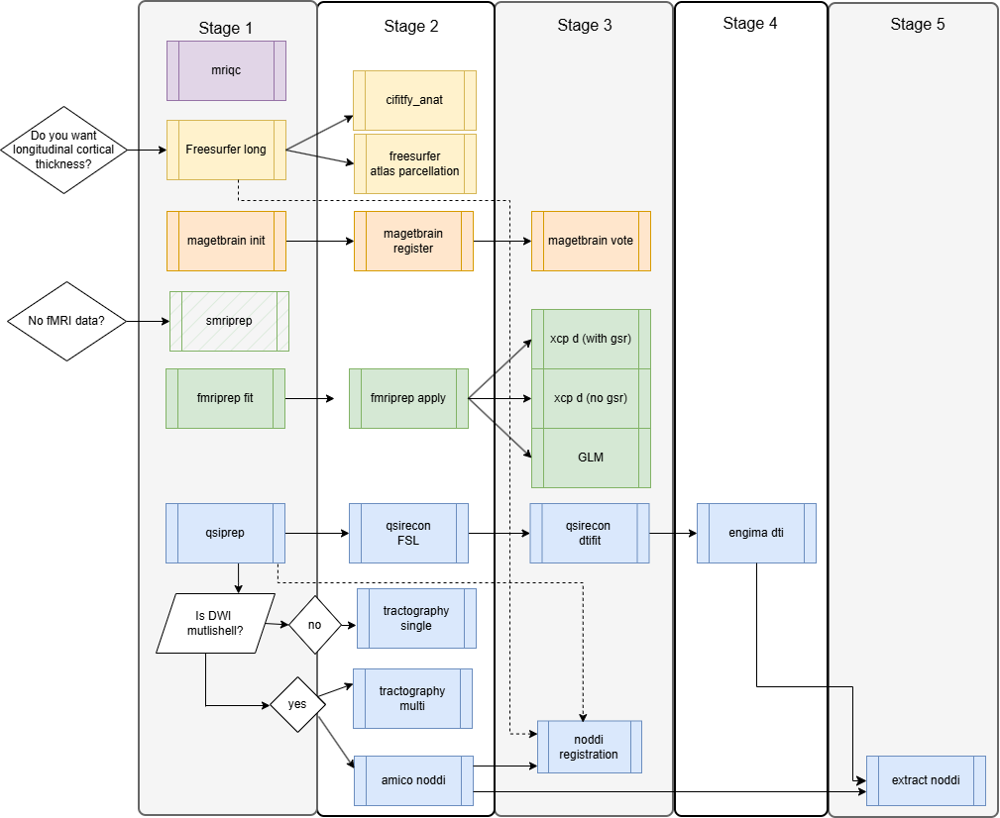

# 🧠 SCanD_project

This is the base repository for the **Schizophrenia Canadian Neuroimaging Database** preprocessing and sharing workflow. Clone or fork this repo once per study cohort, then run the staged pipelines on SciNet.

> **New here?** Start with the [stage overview table](#the-general-overview-of-what-to-do) or [Workflow automation (stage scripts)](Quick_start_workflow_automation.md).

## 📊 Pipeline overview

The diagram below shows how major pipelines are grouped across stages (structural, functional, diffusion, and share/export). For step-by-step commands, use the [stage overview table](#the-general-overview-of-what-to-do) or [Workflow automation (stage scripts)](Quick_start_workflow_automation.md).



## 📚 Key documentation

| | Resource | Purpose |
|---|----------|---------|
| 🚀 | [Quick_start_workflow_automation.md](Quick_start_workflow_automation.md) | Workflow automation with `stage_*.sh` |
| 🔍 | [QC_guide.md](QC_guide.md) | Visual QC criteria for pipeline HTML reports |
| ✅ | [share_folder.md](share_folder.md) | Checklist for `data/share` before consortium handoff |

## 📁 Repository layout

General folder structure for the repo (when all is run):

```
${BASEDIR}
├── code                         # a clone of this repo
│   └── ...    
├── containers                   # the singularity images are copied or linked to here
│   ├── fmriprep-25.2.4.simg
│   ├── mriqc-24.0.0.simg
│   ├── qsiprep-0.22.0.sif
│   ├── freesurfer-7.4.1.simg
│   ├── fmriprep_ciftity-v1.3.2-2.3.3.simg
│   ├── magetbrain.sif
│   ├── nipoppy.sif
│   ├── noddi_postproc-v.1.0.simg
│   ├── tbss_2023-10-10.simg
│   ├── glm-0.0.1.simg
│   └── xcp_d-0.7.3.simg
├── data
│   ├── local                    # folder for the "local" dataset
│   │   ├── bids                 # the defaced BIDS dataset
│   │   ├── derivatives
│   │   │   ├── ciftify          # ciftify derivatives
│   │   │   ├── fmriprep         # fmriprep derivatives
│   │   │   ├── freesurfer       # freesurfer derivative
│   │   │   ├── MAGeTbrain       # MAGETbrain input and output folders
│   │   │   ├── mriqc            # mriqc derivatives
│   │   │   ├── qsiprep          # qsiprep derivatives
│   │   │   ├── smriprep         # smriprep derivatives
│   │   │   ├── xcp_d            # xcp with GSR
│   │   │   └── xcp_noGSR        # xcp with GSR removed
│   │   │  
│   │   ├── dtifit               # dtifit
│   │   ├── enigmaDTI            # enigmadti
│   │   ├── qsiprep            
│   │   ├── qsirecon             # qsirecon derivatives
│   │   └── qsirecon-FSL         # qsirecon FSL
│   |
│   └── share                    # folder with a smaller subset ready to share
│       ├── amico_noddi          # contains only qc images and metadata
│       ├── ciftify              # contains only qc images and metadata
│       ├── enigmaDTI            # enigmaDTI
│       ├── fmriprep             # contains only qc images and metadata
│       ├── freesurfer_group     # contains tsv files of group data
│       ├── magetbrain           # fusion folder
│       ├── mriqc                # contains only qc images and metadata
│       ├── noddireg             # Parcel-wise summary statistics of NODDI microstructural metrics
│       ├── qsiprep              # contains only qc images and metadata
│       ├── smriprep             # contains only qc images and metadata
│       ├── tractify             # contains connectivity.mat file
│       ├── xcp_d                # contains xcp results with GSR
│       └── xcp_noGSR            # contains xcp results with GSR              
├── LICENSE
├── logs               # logs from jobs run on cluster           
├── Neurobagel
├── project_id
├── QC_guide.md
├── Quick_start_workflow_automation.md
├── README.md
├── share_folder.md
├── stage_1.sh
├── stage_2.sh
├── stage_3.sh
├── stage_4.sh
├── stage_5.sh
├── stage_6.sh
└── templates                  # an extra folder with pre-downloaded fmriprep templates (see setup section)
    └── parcellations
        ├── README.md
        |── tpl-fsLR_res-91k_atlas-Glasser_dseg.dlabel.nii
        └── ...  #and 13 other atlases
```

Currently this repo is going to be set up for running things on SciNet Fir cluster - but we can adapt later to create local set-ups behind hospital firewalls if needed.

<a id="the-general-overview-of-what-to-do"></a>

# 🗺️ The general overview of what to do

| stage |  #	| Step	|   Estimated runtime 	|
|---    |---	|---	|---	|
| 🛠️ stage 0|   0a	|  [Setting up the SciNet environment](#setting-your-scinet-environment-and-prepare-dataset)	| ~30 minutes in terminal 	|
|^ |  0b	|  [Organize your data into BIDS](#organize-your-data-into-bids) 	|   Varies by dataset size	|
|^ |  0c	|  [Deface the BIDS data (if not done during step 1)](#deface-the-bids-data-if-not-done-during-step-1) 	|   	|
|^ |  0d	|  [Move your BIDS data to the correct place and add labels to participants.tsv file](#put-your-bids-data-into-the-datalocal-folder-and-add-labels-to-participantstsv-file)	| Depends on data transfer time | 
|^ |   0e	|  [Initializing nipoppy trackers](#initializing-nipoppy-trackers)	| ~2 minutes in terminal 	|
|^ |   0f	|  [Edit fmap files](#1-edit-top-up-fmap-files-only)	| ~2 minutes in terminal 	|
| 1️⃣ stage 1|   01a	|  [Run MRIQC](#running-mriqc) 	|  ~8 hours on Slurm 	|
|^ |  01b	|  [Run QSIprep](#running-qsiprep) 	|   ~6 hours on Slurm	|
|^|   01c	|  [Run freesurfer](#running-freesurfer) 	|   ~23 hours on Slurm	|
|^|   01d	|  [Run fMRIprep fit](#running-fmriprep-fit-includes-freesurfer) 	|   ~16 hours on Slurm	|
|^ |  01e	|  [Run smriprep](#running-smriprep) 	|   ~10 hours on Slurm	|
|^ |  01f	|  [Run magetbrain-init](#running-magetbrain-init) 	|   ~1 hour on Slurm	|
|^ |  01g	|  [Check tsv file](#check-tsv-file) 	|    	|
| 2️⃣ stage 2|   02a	|  [Run fMRIprep apply](#running-fmriprep-apply) 	|  ~3 hours on Slurm 	|
|^ |   02b	|  [Run freesurfer atlas parcellate analysis](#running-freesurfer-atlas-parcellate-analysis) 	|  ~6 hours on Slurm 	|
|^ |   02c	|  [Run ciftify-anat](#running-ciftify-anat) 	|  ~3 hours on Slurm 	|
|^ |   02d	|  [Run qsirecon FSL](#running-qsirecon-fsl) 	|  ~20 minutes on Slurm 	|
|^ |   02e  |  [Run amico noddi](#running-amico-noddi) | ~2 hours on Slurm |
|^ |   02f	|  [Run tractography](#running-tractography) 	|  ~12 hours on Slurm 	|
|^ |   02g	|  [Run magetbrain-register](#running-magetbrain-register) 	|  ~24 hours on Slurm 	|
|^ |   02h  |  [Check tsv file](#check-tsv-file) 	|    	|
| 3️⃣ stage 3 |  03a	|  [Run xcp-d](#running-xcp-d) 	|  ~5 hours on Slurm  |
|^ |   03b  |  [Run xcp-noGSR](#running-xcp-nogsr) 	|  ~5 hours on Slurm  |
|^ |   03c  |   [Run qsirecon dtifit](#running-qsirecon-dtifit) 	|  ~1 hour on Slurm 	|
|^ |   03d	|  [Run noddi-registration](#running-noddi-registration) 	|  ~4 hours on Slurm 	|
|^ |   03e	|  [Run glm-surface](#running-glm) 	|  ~30 minutes on Slurm 	|
|^ |   03f	|  [Run magetbrain-vote](#running-magetbrain-vote) 	|  ~10 hours on Slurm 	|
|^ |   03g	|  [Check tsv file](#check-tsv-file) 	|    	|
| 4️⃣ stage 4 |  04a |  [Run enigma-dti](#running-enigma-dti) 	|  ~1 hour on Slurm	| 
|^ |   04b	|  [Check tsv file](#check-tsv-file) 	|    	|
| 5️⃣ stage 5 |  05a |  [Run extract-noddi](#running-extract-noddi) 	|  ~3 hours on Slurm	|
|^ |   05b	|  [Check tsv file](#check-tsv-file) 	|    	|
| 📤 stage 6 |   06a	|  [Extract and share to consortium folder](#syncing-the-data-to-the-share-directory) 	|   ~8 hours on Slurm (Slurm job and login-node terminal script run together)	|

# ⚙️ Setting your SciNet environment and prepare dataset

## Setting SciNet environment

### Cloning this Repo

Each study should be kept in a **separate `SCanD_project` folder** to prevent overwriting or mixing data between studies.

Before starting a new study:
- Either **rename** the existing `SCanD_project` folder (e.g., `SCanD_project_study1`),  
- Or **move** it elsewhere before cloning the repository again.

```sh
cd $SCRATCH
git clone -b Fir --single-branch https://github.com/TIGRLab/SCanD_project.git
```

### Run the software set-up script

```sh
cd ${SCRATCH}/SCanD_project
source ./code/00_setup_data_directories.sh
```

## Organize your data into BIDS

This is the longest - most human intensive - step. But it will make everything else possible! BIDS is really a naming convention for your MRI data that will make it easier for other people in the consortium (as well as the software/ pipeline that you are using) to understand what your data is (e.g. what scan types, how many participants, how many sessions). Converting your data into BIDS may require some renaming and reorganizing. No coding is required, but there are now a lot of different software projects out there to help with the process.

For amazing tools and tutorials for learning how to BIDS convert your data, check out the [BIDS starter kit](https://bids-standard.github.io/bids-starter-kit/).


### Deface the BIDS data (if not done during step 1)

A useful tool is [this BIDSonym BIDS app](https://peerherholz.github.io/BIDSonym/).


### Put your bids data into the data/local folder and add labels to participants.tsv file

We want to put your data into:

```
./data/local/bids
```
You can do this by either copying "scp -r", linking `ln -s` or moving the data to this place - it's your choice.
If you are copying data from another computer or server, you should use the SciNet datamover (dm) node, not the login node!

To switch into the dm node: 
```sh
ssh <cc_username>@fir.alliancecan.ca
rsync -av <local_server>@<local_server_address>:/<local>/<server>/<path>/<bids> ${SCRATCH}/SCanD_project/data/local/
```

To link existing data from another location on SciNet Fir to this folder:

```sh
ln -s /your/data/on/scinet/bids ${SCRATCH}/SCanD_project/data/local/bids
```

After organizing the BIDS folder, populate participant labels (for example, `sub-CMH0047`) in `${SCRATCH}/SCanD_project/data/local/bids/participants.tsv`. The first row must be `participant_id`; list one subject ID per row below it.

For example:
```bash
participant_id
sub-CMH00000005
sub-CMH00000007
sub-CMH00000012
```
Also, make sure dataset_description.json exists inside your bids folder.

### Initializing nipoppy trackers

In this step, we initialize the [nipoppy trackers](https://nipoppy.readthedocs.io/en/0.2.1/index.html) and set up a folder structure based on the nipoppy directory specification:

```sh
cd ${SCRATCH}/SCanD_project
source ./code/00_nipoppy_trackers.sh
```

### 1. Edit TOP-UP fmap files ONLY.

#### In case you want to backup your json files before editing them:

```sh
mkdir bidsbackup_json
rsync -zarv  --include "*/" --include="*.json" --exclude="*"  data/local/bids  bidsbackup_json
```

In some cases, dcm2niix conversion fails to add the BIDS ``IntendedFor`` field in fmap JSON files, which causes errors in the fmriprep_apply step. Edit those fieldmaps (or run the script below) using a YAML configuration that matches your dataset naming.

This script automatically fills the ``"IntendedFor"`` field in BIDS fieldmap JSON files. It reads a YAML configuration file that describes your dataset's naming patterns, then links each fieldmap to correct fMRI or DWI files.

This helps make your dataset ready for tools like fMRIPrep, QSIPrep, and other BIDS-app pipelines

```sh
## First load a python module
module load python/3.11.5

## Create a directory for virtual environments if it doesn't exist
mkdir ~/.virtualenvs
cd ~/.virtualenvs
virtualenv --system-site-packages ~/.virtualenvs/myenv

## Activate the virtual environment
source ~/.virtualenvs/myenv/bin/activate 

python3 -m pip install pybids==0.15.6

cd $SCRATCH/SCanD_project

python3 ./code/fmap_intended_for.py ./data/local/bids --participant-label ./data/local/bids/participants.tsv --config ./code/config/EPIPHANI_query_config.yaml
```
### 2. What the script does
1. Searches your BIDS dataset for fieldmaps (/fmap)
2. Searches for fMRI and/or DWI data (/func, /dwi)
3. Uses patterns defined in your YAML config to determine which fieldmap file should be used for functional or diffusion scans
4. Writes a correct "IntendedFor" entry into each fieldmap JSON
```bash
fmap/sub-001_ses-01_acq-rest_run-01_epi.json
    → IntendedFor: ["func/sub-001_ses-01_task-rest_run-01_bold.nii.gz",
                    "func/sub-001_ses-01_task-rest_run-02_bold.nii.gz"]

```
### Example of BIDS structure
```lua
sub-001/
  ses-01/
    fmap/
      sub-001_ses-01_acq-rest_dir-AP_run-01_epi.json
      sub-001_ses-01_acq-rest_dir-AP_run-02_epi.json
    func/
      sub-001_ses-01_task-rest_run-01_bold.nii.gz
      sub-001_ses-01_task-rest_run-02_bold.nii.gz
      sub-001_ses-01_task-rest_run-03_bold.nii.gz
    dwi/
      sub-001_ses-01_dwi.nii.gz
```
### 3. YAML Configuration File
You customize how your dataset is structured by editing the YAML file. An example of the config file can be found [here](https://github.com/TIGRLab/SCanD_project/blob/Fir/code/config/EPIPHANI_query_config.yaml)

#### 3.1. Query blocks (how to find files)

Query blocks tell the script which files to search for in the dataset. Each key-value pair corresponds to a **BIDS entity** — the script builds a filename filter from these values and returns all matching files across subjects and sessions.

**Rules:**
- Use a **single string** when all relevant files share one value for that entity (e.g. `task: rest`)
- Use a **list** when files may carry different values for that entity (e.g. `task: [rest, nback, gng]`)
- Set a field to `null` to omit it from the filter (i.e. match any value for that entity)
- Do **not** rename the block keys (`bold_query`, `dwi_query`, `fmap_fmri_query`, `fmap_dwi_query`) — only change the values

---

**BOLD query**

```yaml
bold_query:
  datatype: func
  suffix: bold
  task: rest          # single task — change to a list if you have multiple: [rest, nback, gng]
  extension: nii.gz
```

This matches BOLD files like:
```lua
sub-XXX_ses-01_task-rest_run-XX_bold.nii.gz
```

For a multi-task dataset, use:
```yaml
bold_query:
  datatype: func
  suffix: bold
  task: [rest, nback, gng]
  extension: nii.gz
```

This would match all three task variants:
```lua
sub-XXX_ses-01_task-rest_run-XX_bold.nii.gz
sub-XXX_ses-01_task-nback_run-XX_bold.nii.gz
sub-XXX_ses-01_task-gng_run-XX_bold.nii.gz
```

---

**DWI query**

```yaml
dwi_query:
  datatype: dwi
  suffix: dwi
  extension: nii.gz
```

This matches DWI files like:
```lua
sub-XXX_ses-01_dwi.nii.gz
```

For a dataset with multiple DWI acquisitions (e.g. multi-shell labelled with `acq-`), add the `acquisition` entity:
```yaml
dwi_query:
  datatype: dwi
  suffix: dwi
  acquisition: [multishell, singleshell]
  extension: nii.gz
```

This would match:
```lua
sub-XXX_ses-01_acq-multishell_run-01_dwi.nii.gz
sub-XXX_ses-01_acq-singleshell_run-01_dwi.nii.gz
```

> **Note:** Most datasets have a single unlabelled DWI acquisition — in that case, the default config above (no `acquisition` field) is correct. Add `acquisition` only if your DWI filenames include an `acq-` entity.

---

**Fieldmap query (fMRI)**

```yaml
fmap_fmri_query:
  datatype: fmap
  suffix: [epi, phasediff, phase1, fieldmap]   # list covers all common fieldmap types
  acquisition: rest                             # matches the acq-rest label in the filename; set to null if absent
  extension: json
```

This matches fieldmap JSON sidecar files like:
```lua
sub-XXX_ses-01_acq-rest_dir-AP_run-XX_epi.json
sub-XXX_ses-01_acq-rest_dir-PA_run-XX_epi.json
```

> **Note:** The `acquisition` field here corresponds to the `acq-<label>` entity in the fieldmap filename — it is **not** related to the task label. If your fieldmap filenames do not include an `acq-` entity, set `acquisition: null`.

---

**Fieldmap query (DWI)**

```yaml
fmap_dwi_query:
  datatype: fmap
  suffix: [epi, phasediff, phase1, fieldmap]   # list covers all common fieldmap types
  acquisition: dwi                              # matches the acq-dwi label in the filename; set to null if absent
  extension: json
```

This matches fieldmap JSON sidecar files like:
```lua
sub-XXX_ses-01_acq-dwi_dir-AP_epi.json
sub-XXX_ses-01_acq-dwi_dir-PA_epi.json
```

For a single-shell dataset with no `acq-` label in the fieldmap filename, use:
```yaml
fmap_dwi_query:
  datatype: fmap
  suffix: [epi, phasediff, phase1, fieldmap]
  acquisition: null
  extension: json
```

This would match:
```lua
sub-XXX_ses-01_dir-AP_epi.json
sub-XXX_ses-01_dir-PA_epi.json
```

> **Note:** The `acquisition` field here corresponds to the `acq-<label>` entity in the fieldmap filename — it is **not** the DWI acquisition label. If your fieldmap filenames share an `acq-` label with your fMRI fieldmaps (e.g. both use `acq-rest`), you must use a distinct label (e.g. `acq-dwi`) on the DWI fieldmaps so the two queries return separate file sets. If no `acq-` entity is present in the DWI fieldmap filenames, set `acquisition: null`.

#### 3.2. Mapping blocks (how to assign fieldmaps to BOLD)

> **Important:** You must include an entry for **every session** in `fmap_to_bold` and/or `fmap_to_dwi`. The script only assigns fieldmaps to sessions that are explicitly listed — any session omitted from the config will be skipped and its fieldmaps will not be assigned to any functional or diffusion data.

The `fmap_to_bold` block tells the script which fieldmap(s) should be assigned to which BOLD run(s), on a per-session basis.

**How it works:**
- Each entry under a session lists a **fieldmap key** (`fmap`) and one or more **BOLD keys** (`bold_keys`).
- The `fmap` value is a **substring of the fieldmap filename** — the script matches any fieldmap file whose name contains that string.
- The `bold_keys` values are **substrings of the BOLD filenames** — each matched BOLD file will have its path added to that fieldmap's `IntendedFor` field.

**Example:** Given this dataset structure:
```lua
Fieldmap: fmap/sub-XXX_ses-01_acq-rest_dir-AP_run-01_epi.json
          fmap/sub-XXX_ses-01_acq-rest_dir-AP_run-02_epi.json
          fmap/sub-XXX_ses-01_acq-rest_dir-PA_run-01_epi.json
          fmap/sub-XXX_ses-01_acq-rest_dir-PA_run-02_epi.json
BOLD:     func/sub-XXX_ses-01_task-rest_run-01_bold.nii.gz
          func/sub-XXX_ses-01_task-rest_run-02_bold.nii.gz
          func/sub-XXX_ses-01_task-rest_run-03_bold.nii.gz
```

The following config assigns the AP and PA run-01 fieldmaps to BOLD runs 01 & 02, and the AP and PA run-02 fieldmaps to BOLD run 03 — for both sessions:

```yaml
fmap_to_bold:
  ses-01:
    - fmap: "acq-rest_dir-AP_run-01"
      bold_keys: ["task-rest_run-01", "task-rest_run-02"]

    - fmap: "acq-rest_dir-AP_run-02"
      bold_keys: ["task-rest_run-03"]

    - fmap: "acq-rest_dir-PA_run-01"
      bold_keys: ["task-rest_run-01", "task-rest_run-02"]

    - fmap: "acq-rest_dir-PA_run-02"
      bold_keys: ["task-rest_run-03"]

  ses-02:
    - fmap: "acq-rest_dir-AP_run-01"
      bold_keys: ["task-rest_run-01", "task-rest_run-02"]

    - fmap: "acq-rest_dir-AP_run-02"
      bold_keys: ["task-rest_run-03"]

    - fmap: "acq-rest_dir-PA_run-01"
      bold_keys: ["task-rest_run-01", "task-rest_run-02"]

    - fmap: "acq-rest_dir-PA_run-02"
      bold_keys: ["task-rest_run-03"]
```

**Reading the mapping:**

| `fmap` key | Matches fieldmap file(s) containing... | Assigned to BOLD runs... |
|---|---|---|
| `acq-rest_dir-AP_run-01` | `..._acq-rest_dir-AP_run-01_epi.json` | run-01, run-02 |
| `acq-rest_dir-AP_run-02` | `..._acq-rest_dir-AP_run-02_epi.json` | run-03 |
| `acq-rest_dir-PA_run-01` | `..._acq-rest_dir-PA_run-01_epi.json` | run-01, run-02 |
| `acq-rest_dir-PA_run-02` | `..._acq-rest_dir-PA_run-02_epi.json` | run-03 |

> **Tip:** If your study only has one session, include only `ses-01` under `fmap_to_bold`. If all sessions share the same mapping, duplicate the block for each session.

#### 3.3. Mapping blocks (how to assign fieldmaps to DWI)

> **Important:** You must include an entry for **every session** in `fmap_to_dwi`. The script only assigns fieldmaps to sessions that are explicitly listed — any session omitted from the config will be skipped and its fieldmaps will not be assigned to any diffusion data.

The `fmap_to_dwi` block tells the script which fieldmap(s) should be assigned to which DWI run(s), on a per-session basis. It works the same way as `fmap_to_bold`, but targets diffusion-weighted imaging files instead of BOLD.

**How it works:**
- Each entry under a session lists a **fieldmap key** (`fmap`) and one or more **DWI keys** (`dwi_keys`).
- The `fmap` value is a **substring of the fieldmap filename** — the script matches any fieldmap file whose name contains that string.
- The `dwi_keys` values are **substrings of the DWI filenames** — each matched DWI file will have its path added to that fieldmap's `IntendedFor` field.
- Use a **string** (not a list) for `dwi_keys` when there is only one DWI file per session; use a **list** when there are multiple.

**Example:** Given this dataset structure:
```lua
Fieldmap: fmap/sub-XXX_ses-01_acq-dwi_dir-AP_run-01_epi.json
          fmap/sub-XXX_ses-01_acq-dwi_dir-AP_run-02_epi.json
DWI:      dwi/sub-XXX_ses-01_acq-multishell_run-01_dwi.nii.gz
          dwi/sub-XXX_ses-01_acq-multishell_run-02_dwi.nii.gz
```

The following config assigns both the AP and PA fieldmaps to both DWI runs — for both sessions:

```yaml
fmap_to_dwi:
  ses-01:
    - fmap: "acq-dwi_dir-AP_run-01"
      dwi_keys: ["acq-multishell_run-01"]

    - fmap: "acq-dwi_dir-AP_run-01"
      dwi_keys: ["acq-multishell_run-02"]

  ses-02:
    - fmap: "acq-dwi_dir-AP_run-01"
      dwi_keys: ["acq-multishell_run-01"]

    - fmap: "acq-dwi_dir-AP_run-02"
      dwi_keys: ["acq-multishell_run-02"]
```

**Reading the mapping:**

| `fmap` key | Matches fieldmap file(s) containing... | Assigned to DWI runs... |
|---|---|---|
| `acq-dwi_dir-AP` | `..._acq-dwi_dir-AP_epi.json` | run-01, run-02 |
| `acq-dwi_dir-PA` | `..._acq-dwi_dir-PA_epi.json` | run-01, run-02 |

**Simpler example:** If each session has a single DWI acquisition with no `run-` or `acq-` label:

```lua
Fieldmap: fmap/sub-XXX_ses-01_acq-dwi_dir-AP_epi.json
DWI:      dwi/sub-XXX_ses-01_dwi.nii.gz
```

```yaml
fmap_to_dwi:
  ses-01:
    - fmap: "acq-dwi_dir-AP"
      dwi_keys: "dwi"
  ses-02:
    - fmap: "acq-dwi_dir-AP"
      dwi_keys: "dwi"
```

> **Tip:** If your study only has one session, include only `ses-01` under `fmap_to_dwi`. If all sessions share the same mapping, duplicate the block for each session.

### 4. Output
The script updates each fieldmap JSON like:
```json
{
  "PhaseEncodingDirection": "j-",
  "IntendedFor": [
    "/ses-01/func/sub-001_ses-01_task-rest_run-01_bold.nii.gz",
    "/ses-01/func/sub-001_ses-01_task-rest_run-02_bold.nii.gz"
  ]
}
```
## Notes 

- **Only edit values, not keys**  
  Do **not** rename sections like `bold_query` or `fmap_to_bold`. Change only values, e.g., `task: rest` or `bold_keys: ["task-rest_run-01","task-rest_run-02"]`.

- **bold_keys / dwi_keys**  
  These are **filename patterns**, not arbitrary numbers.  
  Example: if a file is `sub-001_ses-01_task-rest_run-01_bold.nii.gz`, use `bold_keys: ["task-rest_run-01"]`.

- **Acquisition field**  
  - Use the label if present in filenames: `acquisition: rest`  
  - Set to `null` if not in filenames: `acquisition: null`

### Check "IntendedFor" in fieldmap

If your study collected fieldmaps for diffusion data and you plan to use them for distortion correction, you must ensure the ``IntendedFor`` field in your fieldmap files is correctly specified before running stage 1 [Run fMRIPREP Fit](#running-fmriprep-fit-includes-freesurfer), [Run fMRIPREP apply](#running-fmriprep-apply), and [Run QSIprep](#running-qsiprep).

If IntendedFor is missing, fMRIPREP and QSIprep will still run, but it will **ignore** your fieldmap and apply ``synthetic fieldmap`` instead.

This guide shows 
   1. A correct example of fieldmap file with ``IntendedFor`` field
   2. how check all participants before running QSIprep.

**1. Verify a fieldmap manually**

```bash
cd ${SCRATCH}/SCanD_project
grep "IntendedFor" -A 10 data/local/bids/sub-CMH00000027/ses-01/fmap/sub-CMH00000027_ses-01_acq-dwi_dir-AP_epi.json # Replace this with actual path
```
You should see something like 
```json
"IntendedFor": [
    "ses-01/dwi/sub-CMH00000005_ses-01_dwi.nii.gz"
  ]
```
This confirms that the fieldmap is correctly linked to your DWI scan.

**2. Run the QC script**

```bash
## go to the repo and pull new changes
cd ${SCRATCH}/SCanD_project
git pull         #in case you need to pull new code

## Create a directory for virtual environments if it doesn't exist
mkdir ~/.virtualenvs
cd ~/.virtualenvs
module load python
pip install rich
virtualenv --system-site-packages ~/.virtualenvs/myenv

## Activate the virtual environment
source ~/.virtualenvs/myenv/bin/activate
python3 -m pip install pybids==0.15.6

## Go to the repo 
cd ${SCRATCH}/SCanD_project
python3 ./code/check_fmap_json.py ./data/local/bids ./data/local/bids/participants.tsv
```
**3. Interpret the output**

You will see a summary table like this in the terminal:

### Fieldmap QC Summary
| FileName                                        | DataType | IntendedFor       |
| ----------------------------------------------- | -------- | ----------------- |
| sub-CMH0014_ses-01_dwi.nii.gz                   | dwi      | ❌ Invalid/Missing |
| sub-CMH0014_ses-01_task-rest_run-01_bold.nii.gz | func     | ❌ Invalid/Missing |
| sub-CMH0014_ses-01_task-rest_run-02_bold.nii.gz | func     | ❌ Invalid/Missing |
| sub-CMH0014_ses-01_task-rest_run-03_bold.nii.gz | func     | ❌ Invalid/Missing |
| sub-CMH0014_ses-02_dwi.nii.gz                   | dwi      | ❌ Invalid/Missing |
| sub-CMH0014_ses-02_task-rest_run-01_bold.nii.gz | func     | ❌ Invalid/Missing |
| sub-CMH0014_ses-02_task-rest_run-02_bold.nii.gz | func     | ❌ Invalid/Missing |
| sub-CMH0014_ses-02_task-rest_run-03_bold.nii.gz | func     | ❌ Invalid/Missing |

⚠️ Please review failed subjects above.

**Summary:**

- ✅ Passed: 0  
- ❌ Failed: 8 
- Total: 8

> Action: If a ❌ in the IntendedFor column, edit their fieldmap JSON to include the correct BOLD/DWI file paths before running fMRIPrep and QSIPrep.

**Log File**: 

The same summary is saved in a log file for later reference: 

```bash
cat ${SCRATCH}/SCanD_project/logs/fieldmaps_qc_summary.log
```

# 🚀 Quick Start — Workflow Automation

After setting up the SciNet environment and organizing your BIDS folder and `participants.tsv` file, you can run pipelines by stage using [Workflow automation (stage scripts)](Quick_start_workflow_automation.md), or run individual pipelines as described below.

* Note: if you are running xcp-d pipeline (stage 3) for the first time, just make sure to run the codes to download the templateflow files before running the automated codes. You can find these codes below in [xcp-d](#running-xcp-d) section.


# 🔬 Running Pipelines and sharing results

Participant-array pipelines chunk `participants.tsv` the same way as the `stage_*.sh` scripts. When submitting manually, source the shared helper first:

```sh
cd ${SCRATCH}/SCanD_project
source ./code/lib/slurm_array.sh
scand_submit_participant_array ./code/01_mriqc_scinet.sh 1
```

The examples below use `scand_submit_participant_array` with `SUB_SIZE=1` unless noted otherwise.

## Running mriqc

```sh
## go to the repo and pull new changes
cd ${SCRATCH}/SCanD_project
git pull         #in case you need to pull new code

source ./code/lib/slurm_array.sh
scand_submit_participant_array ./code/01_mriqc_scinet.sh 1
```

## Running freesurfer

```sh
## go to the repo and pull new changes
cd ${SCRATCH}/SCanD_project
git pull         #in case you need to pull new code

source ./code/lib/slurm_array.sh
scand_submit_participant_array ./code/01_freesurfer_long_scinet.sh 1
```

## Running fmriprep fit (includes freesurfer)

Note -  the script enclosed uses some interesting extra options:
 - it defaults to running all the fmri tasks - the `--task-id` flag can be used to filter from there
 - it is running `synthetic distortion` correction by default - instead of trying to work with the datasets available fieldmaps - because fieldmaps correction can go wrong - but this does require that the phase encoding direction is specified in the json files (for example `"PhaseEncodingDirection": "j-"`).

```sh
## go to the repo and pull new changes
cd ${SCRATCH}/SCanD_project
git pull         #in case you need to pull new code

source ./code/lib/slurm_array.sh
scand_submit_participant_array ./code/01_fmriprep_fit_scinet.sh 1
```

## Running qsiprep

```sh
## go to the repo and pull new changes
cd ${SCRATCH}/SCanD_project
git pull

source ./code/lib/slurm_array.sh
scand_submit_participant_array ./code/01_qsiprep_scinet.sh 1
```
After QSIPrep completes, a per-pipeline sidecar with the distortion-correction method for each subject is written to:

```sh
./Neurobagel/derivatives/processing_status_qsiprep.tsv
```

This file is updated by the QSIPrep nipoppy tracker block (not the main Neurobagel status under `.processing_statuses/`). It contains:
- participant_id
- session_id
- qsiprep_sdc_method

## Running smriprep
If you want to only run structural data, you will need this pipeline. Otherwise, skip this pipeline.

```sh
## go to the repo and pull new changes
cd ${SCRATCH}/SCanD_project
git pull

source ./code/lib/slurm_array.sh
scand_submit_participant_array ./code/01_smriprep_scinet.sh 1
```

## Running magetbrain init

#### Age and gender for template selection

The `01_magetbrain_init_scinet.sh` script selects **21 template brains** for MAGeTbrain registration. When possible, provide a demographic file so templates match your cohort by age and sex.

**Recommended:** Create `data/local/bids/participants_demographic.tsv` with the same subjects as `participants.tsv` plus two extra columns:

| Column | Header | Example |
|--------|--------|---------|
| 1 | `participant_id` | `sub-CMH00000005` |
| 2 | `age` | `32` |
| 3 | `sex` | `Male` or `Female` |

The script selects 10 male and 11 female templates stratified by age. If `participants_demographic.tsv` is missing, it randomly selects 21 subjects from `participants.tsv` and prints a warning in the job log.

#### Changing Atlas Labels  
By default, the labels in `data/local/derivatives/MAGeTbrain/magetbrain_data/input/atlases/labels` are based on **hippocampus** segmentation.  

To change the segmentation to **cerebellum, amygdala, or another region**:  
1. Remove existing labels:  
   ```bash
   rm data/local/derivatives/MAGeTbrain/magetbrain_data/input/atlases/labels/*
   ```
2. Copy the desired labels from the shared directory:
   ```bash
   cp /scratch/arisvoin/shared/templateflow/atlases_all4/labels/* data/local/derivatives/MAGeTbrain/magetbrain_data/input/atlases/labels/
   ```

### Run the pipeline:
```sh
## go to the repo and pull new changes
cd ${SCRATCH}/SCanD_project
git pull

## submit the array job to the queue
sbatch  ./code/01_magetbrain_init_scinet.sh
```

## Running fmriprep apply 

Note -  the script enclosed uses some interesting extra options:
 - it defaults to running all the fmri tasks - the `--task-id` flag can be used to filter from there
 - it is running `synthetic distortion` correction by default - instead of trying to work with the datasets available fieldmaps - because fieldmaps correction can go wrong - but this does require that the phase encoding direction is specified in the json files (for example `"PhaseEncodingDirection": "j-"`).

```sh
## go to the repo and pull new changes
cd ${SCRATCH}/SCanD_project
git pull

source ./code/lib/slurm_array.sh
scand_submit_participant_array ./code/02_fmriprep_apply_scinet.sh 1
```
After fMRIPrep apply completes, a per-pipeline sidecar with the distortion-correction method for each subject is written to:

```sh
./Neurobagel/derivatives/processing_status_fmriprep.tsv
```

This file is updated by the fMRIPrep apply nipoppy tracker block (not the main Neurobagel status under `.processing_statuses/`). It contains:
- participant_id
- fmriprep_method (e.g., topup fieldmaps, synthetic fieldmaps, or no sdc done)


## Running qsirecon FSL

```sh
## go to the repo and pull new changes
cd ${SCRATCH}/SCanD_project
git pull

source ./code/lib/slurm_array.sh
scand_submit_participant_array ./code/02_qsirecon_FSL_scinet.sh 1
```
## Running amico noddi
In case your data is multi-shell you need to run amico noddi pipeline, otherwise skip this step.

```sh
## go to the repo and pull new changes
cd ${SCRATCH}/SCanD_project
git pull

source ./code/lib/slurm_array.sh
scand_submit_participant_array ./code/02_amico_noddi_scinet.sh 1
```

To complete the final step for amico noddi, you need a graphical user interface like VNC to connect to a remote desktop. This interface allows you to create the necessary figures and HTML files for QC purposes. To connect to the remote desktop, follow these steps:
1. [Install and connect to VNC using login nodes](https://docs.alliancecan.ca/wiki/VNC).
2. Open a terminal on VNC: navigate to Application > System Tools > MATE Terminal.
3. Run the following command:
   
```sh
## go to the repo and pull new changes
cd ${SCRATCH}/SCanD_project
git pull

source ./code/03_amico_VNC.sh
```

## Running freesurfer atlas parcellate analysis


```sh
# module load singularity/3.8.0 - singularity already on most nodes
## go to the repo and pull new changes
cd ${SCRATCH}/SCanD_project
git pull         #in case you need to pull new code

source ./code/lib/slurm_array.sh
scand_submit_participant_array ./code/02_freesurfer_atlas_parcellate_scinet.sh 1
```

If you do not plan to run stage 6 (data sharing) and only wish to obtain the FreeSurfer group outputs, follow these steps to run the FreeSurfer group merge code after completing the FreeSurfer atlas parcellate processing:

```sh
## go to the repo and pull new changes
cd ${SCRATCH}/SCanD_project
git pull

bash ./code/freesurfer_group_merge.sh
```

## Running tractography
For multi-shell data, run the following code. For single-shell data, use the single-shell version of the code.

### tractography output (.mat file)
The final output for the tractography pipeline will be a **.mat** file containing various brain connectivity matrices and associated metadata for different parcellation schemes. The variables include region IDs (e.g., aal116_region_ids), region labels (aal116_region_labels), and multiple connectivity matrices such as aal116_radius2_count_connectivity and aal116_sift_radius2_count_connectivity. These matrices represent connectivity values between brain regions, measured using different methods or preprocessing steps. Similar sets of variables exist for other parcellations, including AAL116, AICHA384, Brainnetome246, Gordon333, and Schaefer100/200/400. If you want to inspect the contents further, you can use the scipy.io library in Python to load and analyze the data, or you can load the file directly in MATLAB.


Multishell:
```sh
## go to the repo and pull new changes
cd ${SCRATCH}/SCanD_project
git pull

source ./code/lib/slurm_array.sh
scand_submit_participant_array ./code/02_tractography_multi_scinet.sh 1

```
Singleshell:
```sh
## go to the repo and pull new changes
cd ${SCRATCH}/SCanD_project
git pull

source ./code/lib/slurm_array.sh
scand_submit_participant_array ./code/02_tractography_single_scinet.sh 1

```

## Running ciftify-anat

```sh
## go to the repo and pull new changes
cd ${SCRATCH}/SCanD_project
git pull

source ./code/lib/slurm_array.sh
SUBJECTS_DIR=./data/local/derivatives/freesurfer/7.4.1
if compgen -G "${SUBJECTS_DIR}/*long*" > /dev/null; then
  N_SUBJECTS=$(ls -d ${SUBJECTS_DIR}/*long* | wc -l)
else
  N_SUBJECTS=$(ls -d ${SUBJECTS_DIR}/sub-* | wc -l)
fi
max_task=$(scand_slurm_array_max "$N_SUBJECTS" 1)
echo "Submitting ciftify_anat with array 0-${max_task}"
sbatch --array=0-${max_task} ./code/02_ciftify_anat_scinet.sh
```

## Running magetbrain register

```sh
## go to the repo and pull new changes
cd ${SCRATCH}/SCanD_project
git pull

## submit the array job to the queue
sbatch  ./code/02_magetbrain_register_scinet.sh
```


## Running xcp-d

If you're initiating the pipeline for the first time, it's crucial to acquire specific files from templateflow. Keep in mind that login nodes have internet access, while compute nodes operate in isolation. Therefore, make sure to download the required files as compute nodes lack direct internet connectivity. Here are the steps for pre-download:


```sh
# First load a python module
module load python/3.10

# Create a directory for virtual environments if it doesn't exist
mkdir ~/.virtualenvs
cd ~/.virtualenvs
virtualenv --system-site-packages ~/.virtualenvs/myenv

# Activate the virtual environment
source ~/.virtualenvs/myenv/bin/activate 

python3 -m pip install -U templateflow

# Run a Python script to import specified templates using the 'templateflow' package
python -c "from templateflow.api import get; get(['fsaverage','fsLR', 'Fischer344','MNI152Lin','MNI152NLin2009aAsym','MNI152NLin2009aSym','MNI152NLin2009bAsym','MNI152NLin2009bSym','MNI152NLin2009cAsym','MNI152NLin2009cSym','MNI152NLin6Asym','MNI152NLin6Sym'])"
```
```sh
# First load a python module
module load python/3.11.5

# Create a directory for virtual environments if it doesn't exist
mkdir ~/.virtualenvs
cd ~/.virtualenvs
virtualenv --system-site-packages ~/.virtualenvs/myenv

# Activate the virtual environment
source ~/.virtualenvs/myenv/bin/activate 

python3 -m pip install -U templateflow

# Run a Python script to import specified templates using the 'templateflow' package
python -c "from templateflow.api import get; get(['fsLR', 'Fischer344','MNI152Lin'])"
```
If you've already set up the pipeline before, bypass the previously mentioned instructions and proceed directly to executing the XCP pipeline:

```sh
## go to the repo and pull new changes
cd ${SCRATCH}/SCanD_project
git pull

source ./code/lib/slurm_array.sh
scand_submit_participant_array ./code/03_xcp_scinet.sh 1
```

## Running xcp-noGSR

```sh
## go to the repo and pull new changes
cd ${SCRATCH}/SCanD_project
git pull

source ./code/lib/slurm_array.sh
scand_submit_participant_array ./code/03_xcp_noGSR_scinet.sh 1
```

## Running noddi-registration

```sh
## go to the repo and pull new changes
cd ${SCRATCH}/SCanD_project
git pull

source ./code/lib/slurm_array.sh
scand_submit_participant_array ./code/03_noddi_reg_scinet.sh 1
```

## Running GLM

**Note:** To run the GLM script correctly, you need:
1) Task **events files**  
2) A **study-specific model JSON**

👉 **IMPORTANT:**  
You **must provide a valid path to your MODEL file**.  
This file defines the regressors in your design matrix and contrasts — the GLM **will not run correctly** if this path is missing or incorrect.

- Use an absolute path (recommended)
- Ensure all of the requirement files exists before submitting the job
- Example models are available in: `code/glm/examples/models/`

For proper set-up, please read these instructions carefully which can be found in [here](code/glm/README.md)

```sh
## go to the repo and pull new changes
cd ${SCRATCH}/SCanD_project
git pull         #in case you need to pull new code

## Provide a path to STUDY-specific model 
MODEL=${PWD}/code/glm/examples/models/RTMSWM/model-001_smdl.json

## sanity check (recommended)
if [ ! -f "$MODEL" ]; then
    echo "ERROR: MODEL file not found at $MODEL"
    exit 1
fi

source ./code/lib/slurm_array.sh

## submit the array job to the queue, passing your task-specific model JSON as an argument
scand_submit_participant_array ./code/03_glm_surface_scinet.sh 1 "${MODEL}"
```

## Running magetbrain vote

```sh
## go to the repo and pull new changes
cd ${SCRATCH}/SCanD_project
git pull

source ./code/lib/slurm_array.sh
N_SUBJECTS=$(ls ./data/local/derivatives/MAGeTbrain/magetbrain_data/input/subjects/brains/*.mnc | wc -l)
max_task=$(scand_slurm_array_max "$N_SUBJECTS" 1)
echo "Submitting MAGeTbrain vote with array 0-${max_task}"
sbatch --array=0-${max_task} ./code/03_magetbrain_vote_scinet.sh
```


## Running enigma extract


```sh
## go to the repo and pull new changes
cd ${SCRATCH}/SCanD_project
git pull

source ./code/ENIGMA_ExtractCortical.sh
```

## Running qsirecon dtifit

```sh
## go to the repo and pull new changes
cd ${SCRATCH}/SCanD_project
git pull

source ./code/lib/slurm_array.sh
scand_submit_participant_array ./code/03_qsirecon_dtifit_scinet.sh 1
```

## Running enigma-dti

```sh
## go to the repo and pull new changes
cd ${SCRATCH}/SCanD_project
git pull

## submit the array job to the queue
sbatch  ./code/04_enigma_dti_scinet.sh
```

## Running extract-noddi

```sh
## go to the repo and pull new changes
cd ${SCRATCH}/SCanD_project
git pull

## submit the array job to the queue
sbatch  ./code/05_extract_noddi_scinet.sh
```


## ✅ Check tsv file

At any stage, before proceeding to the next stage and executing the codes for the subsequent phase, review the latest Neurobagel processing status file under `Neurobagel/derivatives/.processing_statuses/processing_status-*.tsv` (or the copy in `data/share/processing_status.tsv` after stage 6) for all pipelines from the previous stage. For instance, if you intend to execute stage 3 code, you must examine the processing status for all the pipelines in stage 2. If no participants have encountered failures, you may proceed with running the next stage. You can also upload your file to [Neurobagel Digest](https://digest.neurobagel.org/) to gain more insight into the status of your pipelines and to filter them for easier review.

If any participant has failed, amend `data/local/bids/participants.tsv` by **excluding** the IDs of failed participants (keep only subjects you want to rerun). After rectifying the errors, rerun the pipeline with the updated participant list.


## 📤 Syncing the data to the share directory

This step calls group-level BIDS apps to build summary sheets and HTML index pages. It also copies metadata, QC pages, and a smaller subset of summary results into `data/share`.

Submit the Slurm extract job and run the login-node terminal script **together** (as in `stage_6.sh` and the commands below). The Slurm job may take up to ~8 hours on Slurm depending on dataset size; the terminal script runs immediately on the login node for MAGeTbrain QC, qsiprep metrics, and related steps.

```sh
## go to the repo and pull new changes
cd ${SCRATCH}/SCanD_project
git pull

sbatch ./code/06_extract_to_share_slurm.sh
source ./code/06_extract_to_share_terminal.sh
```

When all pipelines are complete, verify `data/share` against [share_folder.md](share_folder.md). Use [QC_guide.md](QC_guide.md) for visual review of HTML QC reports before handoff. Replace `<groupName_studyName>` with your consortium group and study identifier (for example, `CMH_study2024`), then copy results to the shared space:

🎉 **You're done!** Hand off your `data/share` folder to the consortium.

```sh
cd ${SCRATCH}/SCanD_project

mkdir /scratch/arisvoin/shared/<groupName_studyName>
cp -r data/share /scratch/arisvoin/shared/<groupName_studyName>/
```
