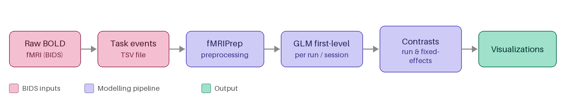

# 🧠 SCanD First-level GLM Analysis Pipeline for fMRI

This repository contains tools for running General Linear Model (GLM) analyses on task fMRI data from the Schizophrenia Canadian Neuroimaging Database (SCanD). It's designed to be forked/cloned for each SCanD dataset.

 

# 📁 Repository Structure

```
glm/
├── src/                  # Core pipeline scripts
├── config/               # Configuration files
├── examples/models/      # Example model specifications
│   ├── OPT/
│   └── RTMSWM/
├── notebooks/            # Jupyter notebooks for analysis
├── templates/            # Surface visualization templates
└── [Other files]         # Dockerfile, requirements, etc.
```

# 🚀 Getting Started

Follow these three essential steps to run the pipeline successfully:

## Step 1: Generate Task Event Files 📝

**Generate `task-events.tsv` file** for each functional task fMRI that you have in your BIDS dataset.

### What are task events files?

Task event files capture the timing and relevant details of occurrences during task-based fMRI acquisition. These events can include presented stimuli, participant responses related to the task, or other notable occurrences during the experiment. A single file can contain any mix of these event types, and events are allowed to overlap in time.

For Example:

| Column Name | Requirement <br> Level | Description |  
|--------| ------------- | -------- |
| `onset` | ✅ REQUIRED | Time when event starts (seconds)
| `duration` | ✅ REQUIRED  | How long event lasts (seconds)
| `trial_type` | ✅ REQUIRED | Label describing the event
| `modulation` | ⚡ OPTIONAL | Trial Intensity or Response Time
<!-- | + Other columns | stim_file, accuracy, etc. | -->

## Parametric modulation (optional)

By default, a GLM assumes that the BOLD response has the same amplitude across all conditions or trial types. However, in many cases we may want the model to account for variations within events. This can be achieved through parametric modulation, where a specific expectation about how strong the BOLD response will for a given event.

To implement this, you can add a “modulation” column to your events files. This allows the model to scale the BOLD response based on values such as trial intensity, response time, or other event-related features. Parametric modulation can both improve model fit and enable testing of hypotheses about how neural responses vary with these characteristics.

<details>
<summary> Example of task-events.tsv content </summary>

| onset  | duration | trial_type        | modulation | correct_response | participant_response |  block    |
|--------|----------|-------------------|------------|------------------|----------------------|-----------|
| 7.000  | 60.000   | onebackblock      |            |                  |                      |    1      |
| 7.000  | 0.000    | oneback           |   0.000    |      0           |      0               |    1      |
| 10.009 | 0.000    | oneback           |   0.702    |      0           |      1               |    1      |
| 13.018 | 0.000    | oneback           |   1.186    |      1           |      1               |    1      |
| ...    | ...      | ...               |   ...      |     ...          |      ...             |   ...     |
| 74.185 | 60.000   | threebackblock    |            |                  |                      |    1      |
| 74.185 | 0.000    | threeback         |   0.000    |      0           |      0               |    1      |
| 77.194 | 0.000    | threeback         |   0.000    |      0           |      0               |    1      |
| ...    | ...      | ...               |   ...      |     ...          |      ...             |   ...     |
</details>

### Where to save files

All functional BOLD fMRI files and corresponding task events files should be saved in the BIDS dataset, specifically ``func/`` directory inside each ``subject/session`` folder:

```
/scratch/ttan/RTMSWM/SCanD_project/data/local/bids/sub-<label>/ses-<label>/func/
```

### Naming Convention
To ensure consistency and reproducibility, follow the BIDS naming convention when creating files.

1. Functional BOLD fMRI files 
```
sub-<label>/ses-<label>/func/sub-<label>_ses-<label>_task-<taskname>_run-<index>_bold.nii.gz
```

2. Task events files
```
sub-<label>/ses-<label>/func/sub-<label>_ses-<label>_task-<taskname>_run-<index>_events.tsv
```
> [IMPORTANT]
> ⚠️ The task, session, and run identifiers in the events file must exactly match those in the corresponding BOLD fMRI file.

In other words: for every functional scan, there should be a matching events file with the same subject, session, task, and run labels. This ensures each events file is correctly paired with its corresponding fMRI data.

Example Directory Structure:
```
sub-CMHWM029/
├── ses-01
│   ├── anat
│   └── func
│       ├── sub-CMHWM029_ses-01_task-nbk_run-1_bold.json
│       ├── sub-CMHWM029_ses-01_task-nbk_run-1_bold.nii.gz
│       ├── sub-CMHWM029_ses-01_task-nbk_run-1_events.tsv
│       ├── sub-CMHWM029_ses-01_task-nbk_run-2_bold.json
│       ├── sub-CMHWM029_ses-01_task-nbk_run-2_bold.nii.gz
│       ├── sub-CMHWM029_ses-01_task-nbk_run-2_events.tsv
└── ses-02
```
This structure illustrates how each BOLD file is paired with an events file using identical naming components.

Further details and instructions are available at this page ([BIDS Specification for Task Events](https://bids-specification.readthedocs.io/en/stable/modality-specific-files/task-events.html)).

### Step 2: Verify fMRIPrep Outputs Are Available

After running fMRIPrep, verify that you have these required files:

- **Preprocessed BOLD data**: `*_space-fsLR_den-91k_bold.dtseries.nii`
- **Confounds**: `*_desc-confounds_timeseries.tsv`

These outputs are placed in the SCanD_project ``derivatives`` directory:
```
SCanD_project/data/local/derivatives/fmriprep/25.2.4/sub-<label>/ses-<label>/func/
```
 
## Step 3: Create BIDS Stats Model JSON File 📊

For the purpose of SCanD consortium, we refer them to model specification. This is the **critical step** to set up first-level GLM analysis configuration.

### What is a BIDS Stats Model?
A JSON file that defines:
- Which task, session, and space to analyze
- The statistical model to use
- Contrasts to compute

### Where to Save Model Specification
Each GLM model must be described in a JSON file. This file tells the analysis which tasks, sessions, and conditions to include.

Save the model specification file here:

```
/SCanD_project/code/glm/examples/models/<STUDY_NAME>_model-<number>_smdl.json
```
- ``STUDY_NAME``: the short name of your study (e.g., MemoryStudy)
- ``number``: version or index of your model (e.g., 01)

### Example Model Specification:

Below is an example JSON file. It describes a task-based fMRI GLM with conditions and contrasts:
```json
{
  "Name": "YourStudyModelName",
  "BIDSModelVersion": "1.0.0",
  "Description": "Describe your model here.",
  "Input": {
    "task": ["nbk"],
    "session": ["01"],
    "space": "fsLR",
    "dense": "91k"
  },
  "Nodes": [
    {
      "Level": "Run",
      "Name": "run_level",
      "GroupBy": ["run", "subject"],
      "Model": {
        "X": [
          "threebackblock",
          "onebackblock",
        ],
        "Type": "glm" 
      },
      "Contrasts": [
        {
          "Name": "threebackblockminusonebackblock",
          "ConditionList": ["threebackblock", "onebackblock"],
          "Weights": [1, -1],
          "Test": "t"
        },
        {
          "Name": "threebackblock",
          "ConditionList": ["threebackblock"],
          "Weights": [1],
          "Test": "t"
        },
        {
          "Name": "onebackblock",
          "ConditionList": ["onebackblock"],
          "Weights": [1],
          "Test": "t"
        },
      ]
    }
  ]
}
```
#### What You Need to Customize

### Model
| Key / Field | Description                  | Value                               |
|-------------|------------------------------|-------------------------------------|
| `"task"`    | Task name(s) from BIDS       | `["nbk"]`                           |
| `"session"` | Session number(s) to include | `["01","02"]` or <br>`""` if dataset has no sessions |
| `"X"`       | Trial types from events.tsv  | `["threebackblock","onebackblock"]` |
| `"Type"`    | Model type                   | `"glm"`                             |

### Contrast
| Key / Field        | Description                         | Value                               | 
|--------------------|-------------------------------------|-------------------------------------|
| `"Name"`           | Name of the contrast                | `"threeback_vs_oneback"`            |
| `"ConditionList"`  | Conditions included in contrast     | `["threebackblock","onebackblock"]` |
| `"Weights"`        | Numeric weights for each condition  | `[1,-1]`                            |
| `"Test"`           | Type of statistical test            | `"t"`                               |

**Key Tips**:

- Keep the task and session identifiers consistent with your task events & BOLD fMRI filenames.

- The trial types (X) must exactly match the labels used in your events.tsv files.

- Define at least one contrast to test (e.g., condition A vs condition B).

> **Reference:** [BIDS Stats-Models Documentation](https://bids-standard.github.io/stats-models/motivation.html)

## 🗂 Pipeline Outputs

The GLM pipeline produces these files:

| Category | Files | Description |
|----------|-------|-------------|
| **Model Metadata** | `dataset_description.json`<br>`statmap.json` | Information about modeling software and parameters. |
| **Design Matrix** | `design.tsv`<br>`design.svg` | The model design in tabular and visual formats. |
| **Model Fit** | `stat-mean_square_error_statmap.dscalar.nii`<br>`stat-r_square_statmap.dscalar.nii` | Model performance metrics. |
| **Run-level Contrast Results** | `contrast-[name]_stat-effect_size_statmap.dscalar.nii`<br>`contrast-[name]_stat-t_statmap.nii.gz`<br>`contrast-[name]_stat-p_statmap.nii.gz`<br>`contrast-[name]_stat-z_statmap.nii.gz` | Statistical maps for each contrast at the **run level**. |
| **Fixed-effects Contrast Results** | `contrast-[name]_stat-fixed_effect_size.dscalar.nii`<br>`contrast-[name]_stat-fixed_t_statmap.nii.gz` | Statistical maps summarizing multiple runs using **fixed-effects analysis**. |
| **Visualizations** | `contrast-[name]_stat-effect_size_statmap.png`<br>`contrast-[name]_design.svg` | Figures showing beta-coefficient results and contrast design. |


## Technical Notes

- The pipeline is designed to run on SciNet cluster with BIDS datasets
- The first 4 seconds of fMRI data are automatically dropped to minimize early signal instability
- Surface-based analysis uses the fsLR space at 91k density

---

> **Need help?** For more information about BIDS formatting or GLM analysis, consult the [BIDS documentation](https://bids-specification.readthedocs.io/) and [Nilearn documentation](https://nilearn.github.io/stable/glm/index.html#glm) or open an issue in this repository.
