# fMRIPrep QC

**Location (repo sample):** `sample_data/fmriprep/<subject>/` — BIDS NIfTIs in `bids/`, figures in `figures/`. In production, point `--dataset_dir` at your fMRIPrep share (same flat layout per subject).

**In QC-Studio:** `sdc_wf_qc`, `coreg_wf_qc`. Anatomical / recon-all QC is in **`../freesurfer/qc.json`** (`anat_wf_qc`).

## Purpose and Scope

This QC protocol ensures that fMRIPrep outputs meet quality standards before they are used for downstream analysis. It is intended for students or research assistants who are reviewing fMRI preprocessing outputs through the Streamlit QC app.

fMRIPrep is a preprocessing pipeline for structural and functional MRI data. It generates preprocessed anatomical and functional images, brain masks, quality reports etc. In this QC guide, the main focus is on two visual checks: **Susceptibility Distortion Correction** and **T1w–EPI Coregistration**.

The purpose of QC is to identify scans that clearly pass, fail, or need supervisor review. Minor imperfections are expected. The goal is not to fail every scan with small artifacts, but to catch cases where preprocessing has clearly failed or may affect analysis.

## Getting Started with the Interface

Before starting QC, make sure fMRIPrep has successfully run for the subject or session. The output folder should contain fMRIPrep derivatives and visual reports for each participant.

Open the subject/session in the Streamlit QC app and review the available QC panels.

For **`sdc_wf_qc`**, compare the before and after images and decide whether the corrected image aligns better with the outline.

For **`coreg_wf_qc`**, check whether the functional image aligns properly with the anatomical image, especially around the brain boundaries, ventricles, sulci, and major structures.

If the scan clearly meets the pass criteria, mark it as **PASS**. If it clearly meets the fail criteria, mark it as **FAIL**. If the case is uncertain or borderline, mark it as **UNCERTAIN** for supervisor review.

## Susceptibility Distortion Correction (`sdc_wf_qc`)

Susceptibility Distortion Correction (SDC) checks whether distortion in the functional/EPI image has been corrected properly. Compare the image before and after correction and decide whether the corrected image aligns better with the brain red outline. A good correction should improve the shape and position of the brain, or at least not make it worse.

### What the Red Outline Means

In the SDC QC images, the red outline represents the reference anatomical/brain boundary used to judge alignment. The red outline helps show where the corrected EPI image should approximately fit after distortion correction.

Some parts of the red outline may look incomplete because of weak signal or signal loss, especially in medial regions. This can still pass if the correction works overall.

### What to Check

- Check that the participant image includes the brain only and does not include major non-brain structures such as the skull or spinal cord.
- Compare the Before and After SDC images carefully. The corrected image should move closer to the red outline and should look more anatomically accurate after correction. There is no specific direction that the image must move in; the corrected image simply needs to move closer to the red outline overall.
- Also check whether the correction makes the distortion better or worse. If the correction is very small or barely noticeable, this can still pass as long as the corrected image is not worse than the original image.
- Always check all axes as a whole before deciding.

### Good Example

  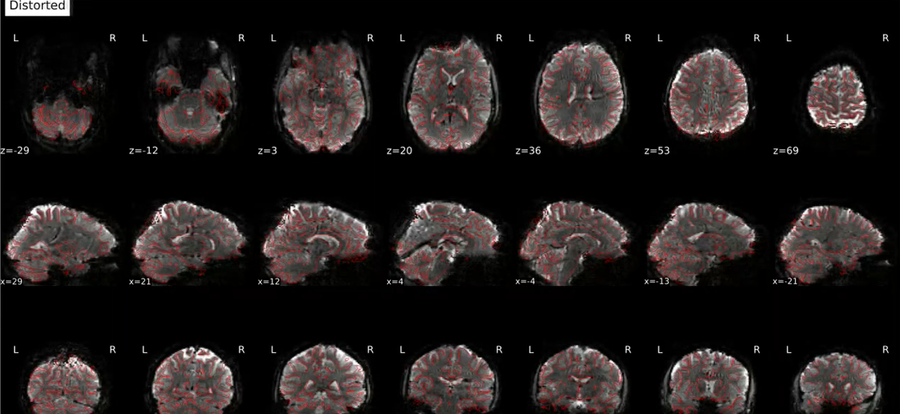 
  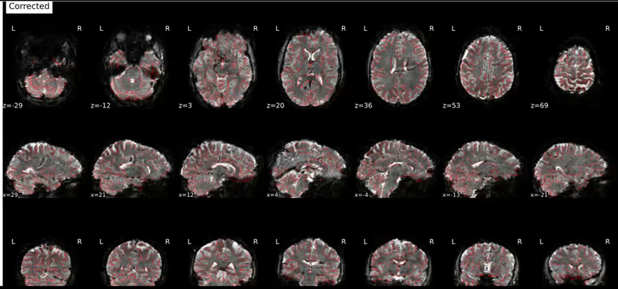

The corrected version moves closer to the red outline.

### Common Issues

#### Miscorrection

The corrected version moves away from the red outline and the brain gets more distorted. **→ FAIL**

  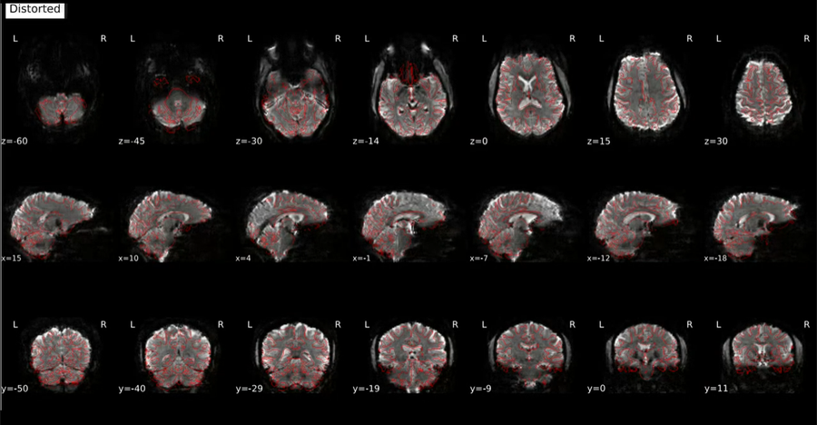 
  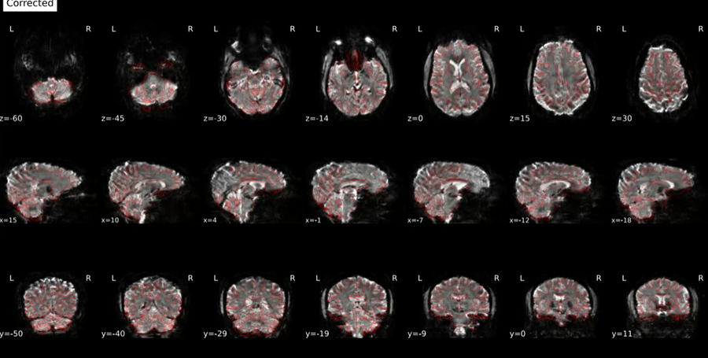

#### Distorted image

The corrected images are very distorted. The shape of the brain and the outline do not match. **→ FAIL**

   
  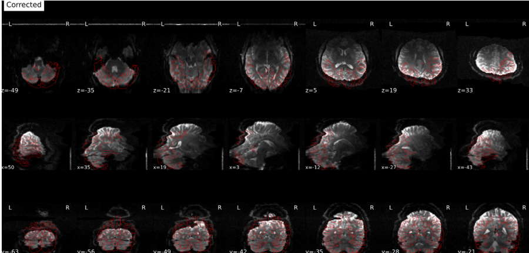

#### Signal dropout

Dark or missing regions in the image. Can **PASS** in expected areas (temporal lobe, midbrain, orbitofrontal). **FAIL** only if severe and affecting major brain coverage.

#### Inconsistent patches

Some brain regions appear darker or brighter than the rest. Can **PASS** if overall alignment and correction are acceptable.

  
  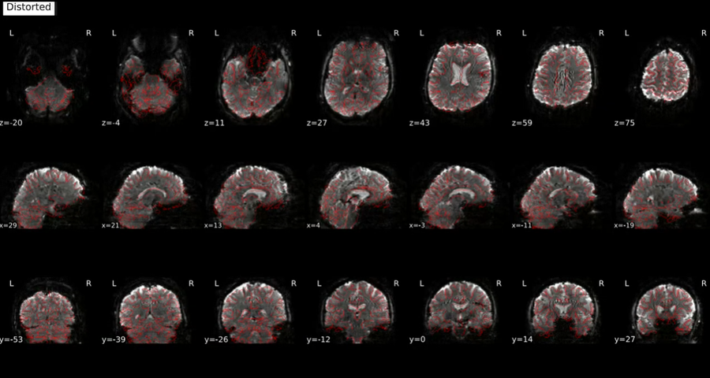

#### In-plane intensity change

Intensity change within the same plane, sometimes like a line across the brain. Can **PASS** if not severe; **UNCERTAIN** or **FAIL** if it looks like a clipped region or affects interpretation.

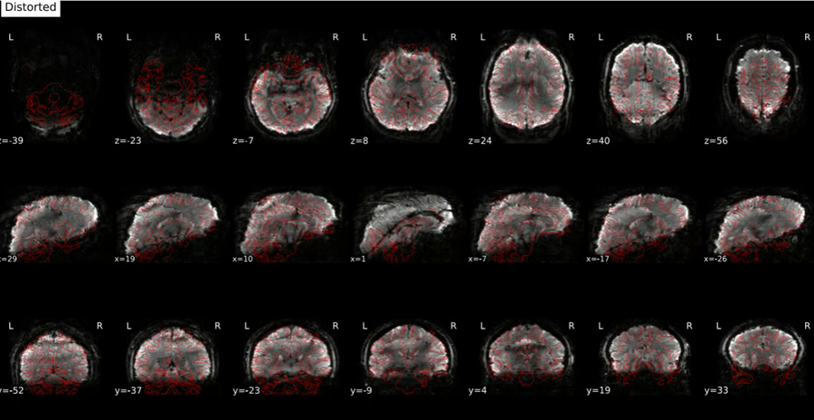

#### Clipping

Part of the brain image is cut off. Cerebellum clipping can **PASS**; cortex clipping should **FAIL**.

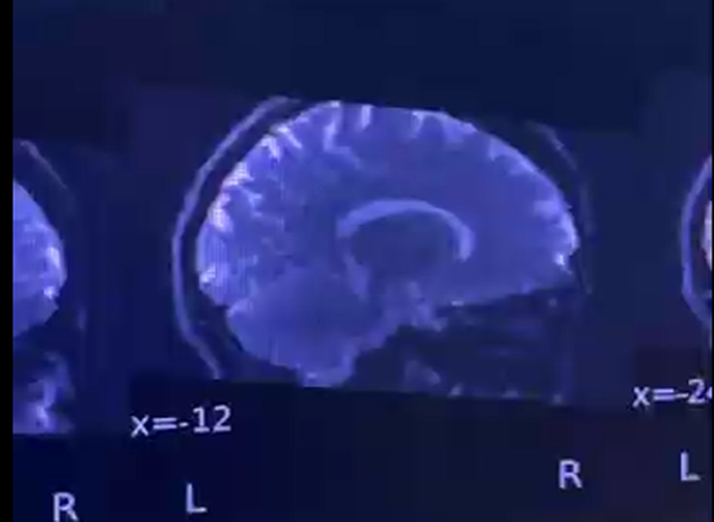

#### Background peripheral EPI artifact

Shadows around the outside of the brain. Usually **PASS** if it stays in the background and does not affect the brain image.

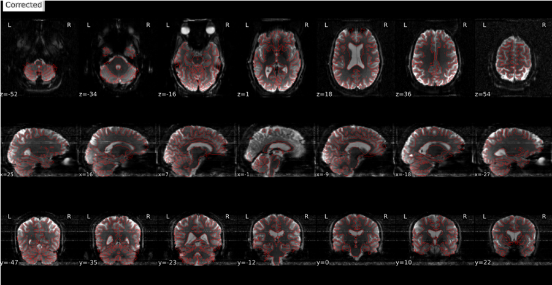

#### Ventricular stretching

Ventricles appear stretched after SDC correction. Mild stretching can **PASS**; significant stretching → **FAIL** or **UNCERTAIN**.

  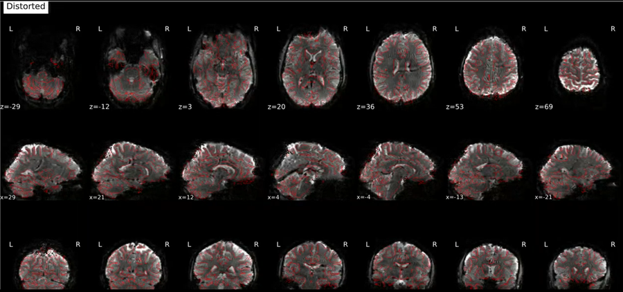 
  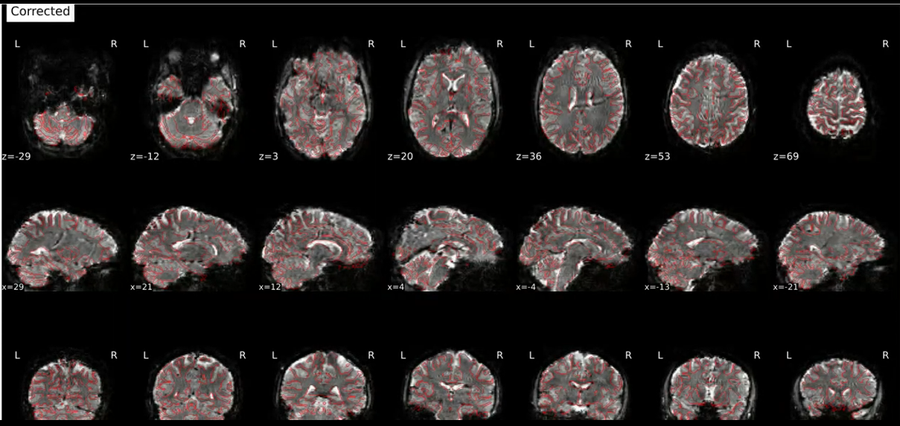

#### Weak signal or signal loss

Incomplete red outline due to weak medial signal. Can **PASS** if correction still works overall.

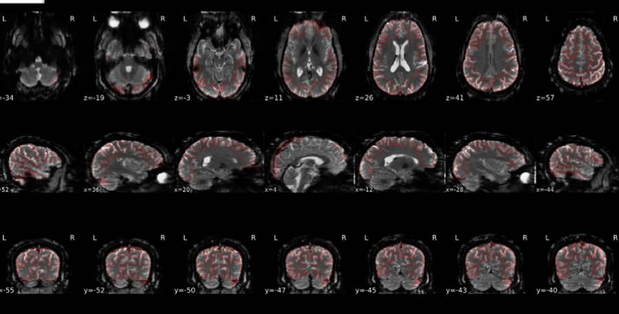

#### Skull or spinal cord included

Usually not problematic and can **PASS** if correction works and the brain image is acceptable — flag if concerned.

#### Very negligible SDC correction

Before and After images look almost the same. Usually **PASS** as long as After is not worse than Before.

## T1w to EPI Coregistration (`coreg_wf_qc`)

T1w to EPI Coregistration checks whether the functional/EPI image is properly aligned with the participant’s anatomical T1w image. The main goal is to see whether brain boundaries, ventricles, sulci, and major structures line up correctly. **FAIL** or flag if there is a clear shift, rotation, mismatch in shape or size, or if the brain appears outside the skull.

### What to Check

- Check whether major brain structures, ventricles, brain boundaries, and overall brain shape align between the T1w and EPI images.
- The brain should stay inside the skull; shape and size should match across images.
- Look for shift, rotation, or mismatch — especially at the top and bottom of the brain.
- Review all axes before making the final decision.

### Good Example

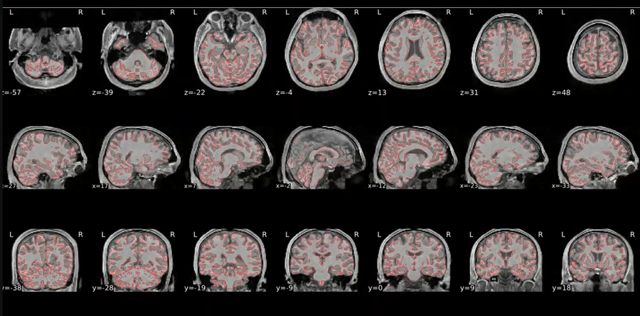

There is no misalignment and the major boundaries match.

### Common Issues

#### Misalignment

Mismatch in brain boundaries, ventricles, or overall brain shape between T1w and EPI.

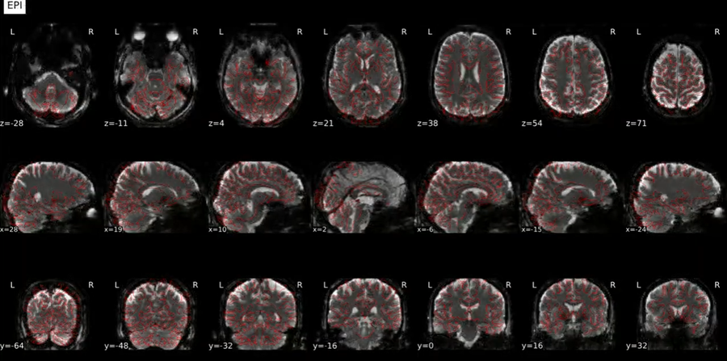

#### Noticeable shift

Shift at the top, bottom, or along one axis.

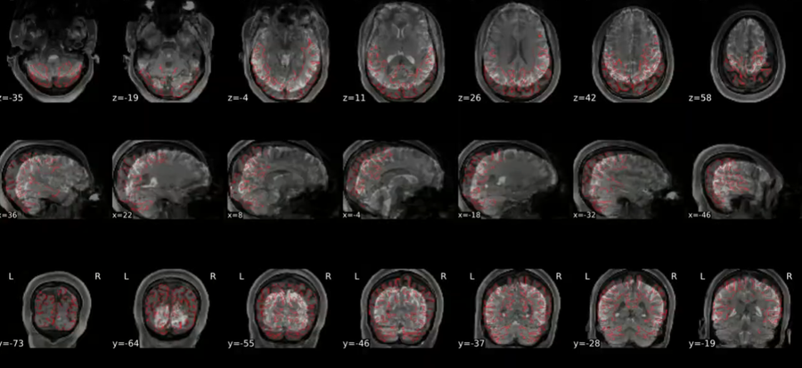

