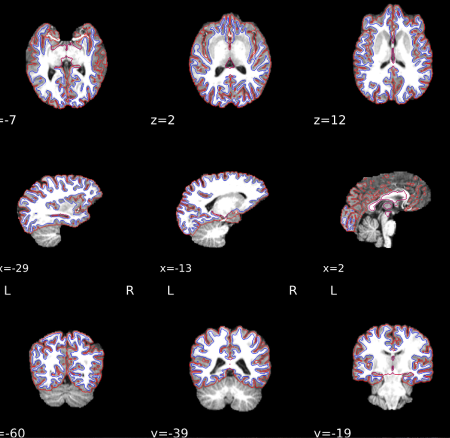
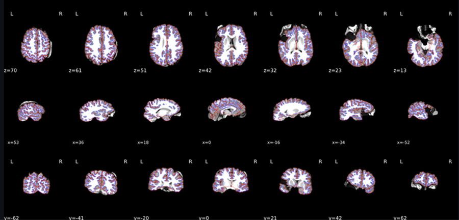
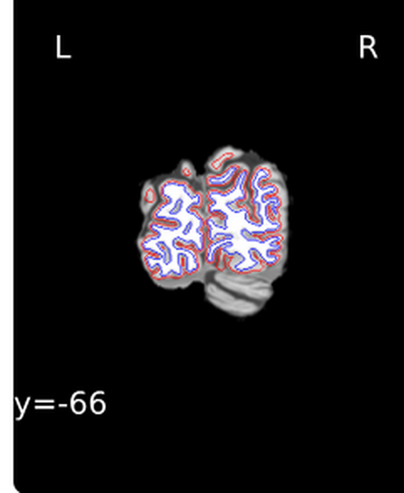
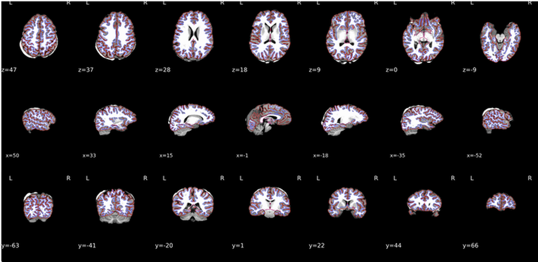
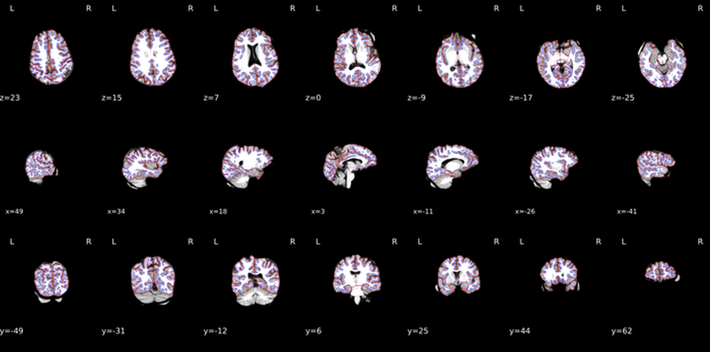
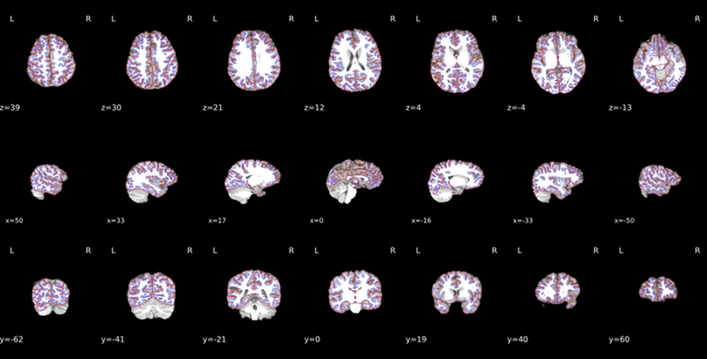
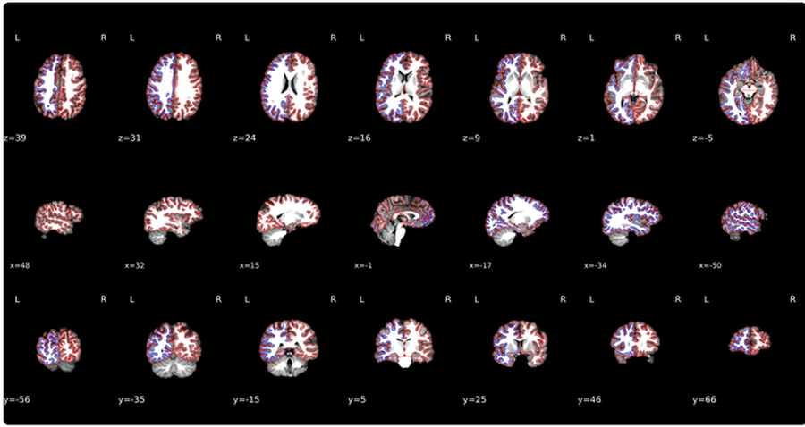

# FreeSurfer QC

**Location (repo sample):** `sample_data/fmriprep/<subject>/` — preprocessed T1w, brain mask, and recon-all figure. In production, point `--dataset_dir` at your fMRIPrep/FreeSurfer share (same flat layout per subject).

**In QC-Studio:** `anat_wf_qc`.

## Purpose and Scope

This QC protocol ensures that FreeSurfer outputs meet quality standards before they are used for downstream analysis. It is intended for students or research assistants who are reviewing FreeSurfer outputs through the Streamlit QC app.

FreeSurfer is a neuroimaging pipeline used for cortical reconstruction from anatomical T1-weighted images. FreeSurfer produces outputs that are used to measure brain structure, including cortical thickness, cortical surface area, regional brain volumes, and white matter/gray matter boundaries.

The purpose of FreeSurfer QC is to check whether the automated segmentation outlines the brain and white matter correctly and to identify scans that clearly pass, fail, or need supervisor review. Small imperfections are expected, so the goal is not to fail every scan with minor errors. The goal is to identify cases where FreeSurfer clearly failed, where major brain regions are missing, or where the red/blue outlines are incorrect in a way that may affect downstream analysis.

## Getting Started with the Interface

Before starting QC, make sure FreeSurfer has successfully run for the subject or session. The output folder should contain FreeSurfer derivatives and visual reports for each participant.

Open the subject/session in the Streamlit QC app and review the **`anat_wf_qc`** panel. For each scan, check whether the participant image includes the brain only and whether the segmentation outlines are placed correctly.

The main things to check are the red outline, the blue outline and Euler values. Always check all axes before making a final decision, because some issues may only be visible in one view.

If the scan clearly meets the pass criteria, mark it as **PASS**. If the scan clearly meets the fail criteria, mark it as **FAIL**. If the case is uncertain or borderline, mark it as **UNCERTAIN** for supervisor review.

## Anatomical Surface Segmentation (`anat_wf_qc`)

FreeSurfer QC focuses mainly on surface segmentation. It checks whether the brain mask, cortical outline, and white matter outline are accurate. The main goal is to make sure that the red and blue outlines follow the correct brain structures and do not extend into skull or non-brain tissue.

### What the Red Outline Means

The red outline represents the skullstrip or outer brain boundary. It should follow the outside of the brain and should not extend into the skull. The red outline is used to check whether FreeSurfer correctly identified the brain boundary. In this QC guide, the cerebellum should be excluded from the cortical outline. If major parts of the cortex are missing from the red outline, the scan should fail.

### What the Blue Outline Means

The blue outline traces the white matter area, which usually appears as the lighter inner part of the brain. It should follow the white matter boundary and should not extend into the skull or non-brain tissue. If the blue outline excludes major parts of the white matter, the scan should fail.

### What to Check

- Check that the participant image includes the brain only. The scan should not show major skull or spinal cord inclusion. If skull or spinal cord is visible, this may need to be flagged. This is called over-inclusive masking. Only rate the scan as fail if the red or blue outline extends into the skull.
- Check that both the red and blue outlines are present. If either outline is missing, the scan should be flagged because it is difficult to judge the segmentation properly.
- Check that the red outline follows the outer brain boundary. The red outline should trace the brain and should not include skull. The red outline should follow the cortex but should exclude the cerebellum. If parts of the cerebellum are missing from the outline, this can pass. The more important issue is whether major parts of the cortex are missing.
- Check that the blue outline follows the white matter area. The blue outline should stay within the lighter white matter region and should not extend into skull, spinal cord, or non-brain tissue.

### Good Example

The red line is outlining the brain and the blue line is outlining white matter. No non-brain regions are included and the cerebellum is excluded.

### Common Issues

#### Over-inclusive FreeSurfer masking

Occurs when a big portion of the skull is included in the image. The image should ideally only show the brain. However, this rating does not automatically constitute a Fail. Only rate as fail if the red or blue outline extends into the skull.

#### Underexclusive masking

Occurs when major parts of the cortex are excluded from the outline. For example, if major parts of the frontal cortex are excluded, mark the scan as underexclusive. The scan should fail.

  
  

#### Temporal lobe excluded from the outline

A common issue is the temporal lobe being excluded from the outlining. This should be checked carefully across all axes. If the exclusion is major, the scan should be failed or flagged for supervisor review.

#### Minor portion of skull included

The participant brain should only include brain and should not include skull. However, skull appearing in the background does not automatically mean fail. The scan should fail only if the red or blue outline extends into the skull.

   
  

#### Minor portion of cerebellum included

The participant brain should only include the cortex. However, the outline can sometimes extend into the cerebellum. The scan should not be Fail but should be flagged.

The outline in x=17, x=-16 and y=-62 extend into the cerebellum.

#### Missing red or blue outline

Both red and blue outlines should be present. If one outline is missing, the scan should be flagged because the segmentation cannot be judged properly.

## Euler Values

### What Are Euler Values

Euler values should be checked as part of FreeSurfer QC, but they are usually automatically rated in the interface. In general, the expected Euler value range is **-150 to 2**. However, Euler values are not the only deciding factor. For each study, we will also review the distribution of Euler values across participants before making final decisions. A scan can still pass if the segmentation is visually correct, even if the Euler value is not ideal.

### What to Check

- Check the Euler value shown in the interface.
- In general, Euler values are expected to be between -150 and 2.
- Check the distribution of Euler values within the study before making final decisions.
- Do not fail a scan based only on the Euler value if the segmentation looks visually correct.
