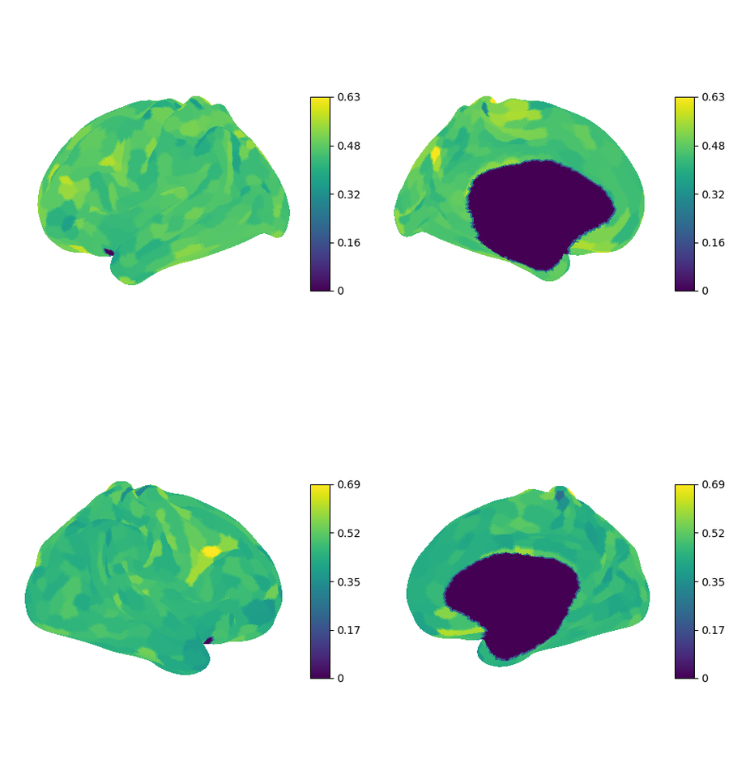
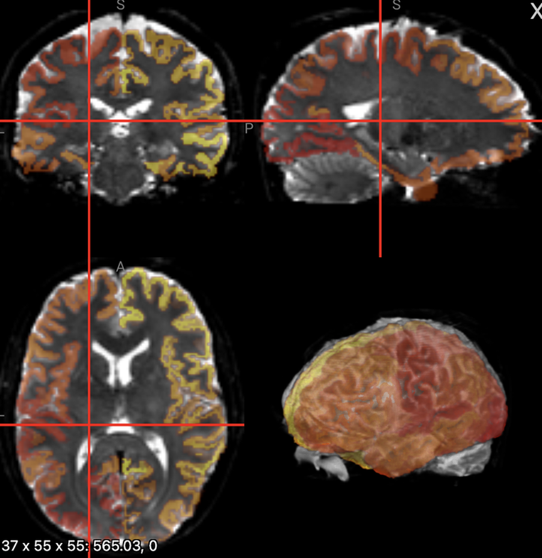
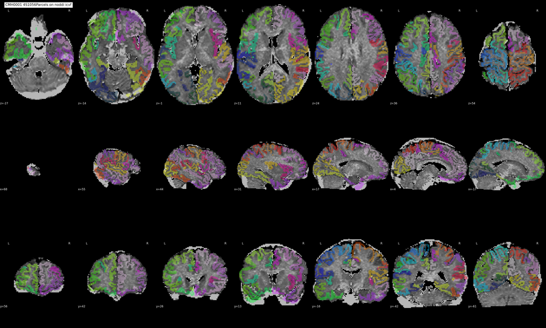
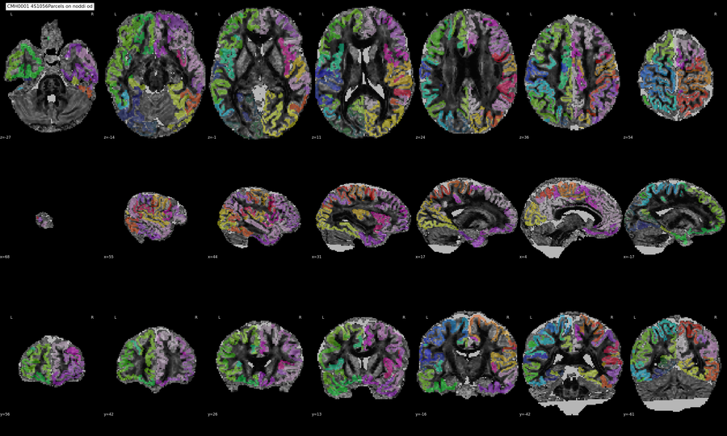
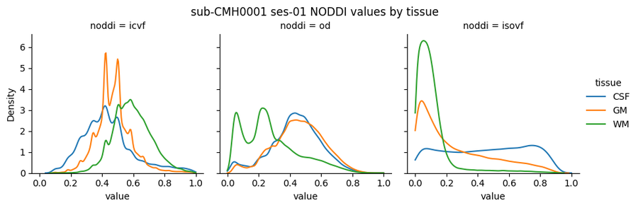

# NODDIreg QC

**Location (repo sample):** `sample_data/noddireg/<subject>/` — PNGs under `figures/`; subject-level NIfTIs (`*_dwiref.nii.gz`, `*_dseg.nii.gz`) at the subject root. In production, point `--dataset_dir` at your NODDIreg share (`data/share/noddireg`, same layout per subject).

**In QC-Studio:** `noddireg_od_icvf_isovf`, `noddireg_parcellation_overlay`, `noddireg_density`.

## Purpose and Scope

Visually check that NODDI metrics were correctly registered to anatomy and that shared QC images look plausible before consortium release.

NODDIreg produces cortical surface maps, parcellation overlays, and tissue-density plots for intracellular volume fraction (ICVF), orientation dispersion (OD), and isotropic volume fraction (ISOVF). This guide matches the three QC tasks in QC-Studio.

## Getting Started with the Interface

Before starting QC, make sure NODDIreg has successfully run for the subject or session. The output folder should contain NODDIreg derivatives and PNG figures for each participant.

Open the subject/session in the Streamlit QC app and review the three NODDIreg tasks. For each scan, check surface maps, parcellation alignment, and tissue-density distributions.

If the scan clearly meets the pass criteria, mark it as **PASS**. If it clearly meets the fail criteria, mark it as **FAIL**. If the case is uncertain or borderline, mark it as **UNCERTAIN** for supervisor review.

## Cortical Surface Maps (`noddireg_od_icvf_isovf`)

Surface QC PNGs show parcel-averaged NODDI values from the 4S1056 atlas on the cortical surface.

**Files (`figures/`):**

- `figures/sub-XXXX_ses-XX_icvf_mean_qc.png`
- `figures/sub-XXXX_ses-XX_od_mean_qc.png`
- `figures/sub-XXXX_ses-XX_isovf_mean_qc.png`

**Layout:**

- Top left: Left hemisphere, lateral view
- Top right: Left hemisphere, medial view
- Bottom left: Right hemisphere, lateral view
- Bottom right: Right hemisphere, medial view

Color scale shows NODDI values across cortical parcels.

### Good Example

### What to Check

- Smooth, anatomically plausible cortical patterns
- Most of the cortical surface is colored (few large gaps)
- Gradual transitions between regions (no obvious artifact patches)
- ICVF, OD, and ISOVF all look reasonable
- Mild left-right asymmetry is acceptable

### Common Issues — **FAIL if:**

- Large holes or missing regions across the cortical surface
- Maps look flat or near-zero across most of cortex
- Obvious artifact patches or extreme discontinuities
- Strong unexplained left-right differences suggesting a processing error

## Parcellation Overlay (`noddireg_parcellation_overlay`)

Parcellation overlay checks alignment between the DWI reference image and the 4S1056 parcellation in two views: the **Niivue 3D MRI panel** (interactive) and **QA PNG mosaics** (slice views).

### Niivue 3D MRI overlay

In QC-Studio, the left panel shows the DWI reference (`*_space-T1w_dwiref.nii.gz`) with the parcellation overlay (`*_desc-4S1056Parcels_dseg.nii.gz`). Use the Niivue controls to inspect alignment in 3D and across slices.

**Files (subject root):**

- `sub-XXXX_ses-XX_*_space-T1w_dwiref.nii.gz` — QSIPrep DWI reference in T1w space
- `sub-XXXX_space-T1w_ref-dwiref_desc-4S1056Parcels_dseg.nii.gz` — 4S1056 parcellation resampled to the DWI reference grid

**Check:**

The colored parcel labels should sit on brain tissue, follow cortical and subcortical anatomy, and not appear shifted, rotated, or scaled relative to the dwiref background. Parcel boundaries should not extend into ventricles, skull, or background, and expected brain regions should be covered.

**FAIL if:**

- Parcels are clearly shifted from brain tissue, appear in ventricles/skull/background, or large brain areas are missing parcels

### QA PNG mosaics

**Files (`figures/`):**

- `figures/sub-XXXX_ses-XX_desc-4S1056Parcels_model-noddi_mdp-icvf_qa.png`
- `figures/sub-XXXX_ses-XX_desc-4S1056Parcels_model-noddi_mdp-od_qa.png`

Mosaic slice views show the 4S1056 parcellation (colored regions) overlaid semi-transparently on the underlying NODDI map.

  
  

**Check:**

- Parcels sit on brain tissue and follow anatomy
- No obvious shift, rotation, or scaling error
- Parcel boundaries do not extend into ventricles, skull, or background
- Parcels cover expected brain regions

**FAIL if:**

- Parcels clearly shifted relative to brain tissue
- Parcels visible in ventricles, skull, or background
- Large brain regions missing parcels, or parcels only outside brain

## Tissue Density Distributions (`noddireg_density`)

The tissue density plot checks whether NODDI values look biologically sensible when separated by tissue type (CSF, GM, WM). It shows statistical distributions of voxel values — not brain slices.

**File:** `figures/sub-XXXX_ses-XX_desc-dsegtissue_model-noddi_density.png`

The plot is built from NODDI maps (ICVF, OD, ISOVF), QSIPrep anatomical tissue labels (dseg), and voxels with ICVF between 0 and 0.99.

**Layout:** Three side-by-side panels — ICVF, OD, ISOVF. Each panel has three colored curves (CSF, GM, WM).

### Good Example

### What to Check

- **ICVF:** WM peak is to the right of GM; CSF curve is usually separated from brain tissue.
- **OD:** Tissue curves should be visibly different; complete overlap across all tissues is suspicious.
- **ISOVF:** CSF peak is to the right of WM/GM; CSF should be clearly separable from brain tissue in most cases.

### Common Issues — **FAIL if:**

- CSF, GM, and WM curves overlap almost completely in one or more panels
- ICVF panel shows WM and GM at the same x position with no separation
- ISOVF panel shows CSF not separated from brain tissue
- One curve is mostly a spike at 0 or 1 (suggests masking/fitting problem)
- Curves look flat, empty, or clearly broken
