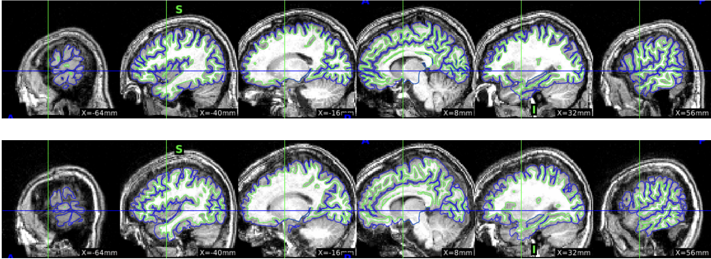

# QC Guide

Pipeline-specific QC protocols (copied from QC-Studio `pipelines/*/`*_QC_guidelines.md):

Example images for the four pipeline guidelines are in [qc_guidelines_assets/](qc_guidelines_assets/).

| Pipeline | Guideline |
|----------|-----------|
| fMRIPrep | [fmriprep_QC_guidelines.md](fmriprep_QC_guidelines.md) |
| FreeSurfer | [freesurfer_QC_guidelines.md](freesurfer_QC_guidelines.md) |
| QSIPrep | [qsiprep_QC_guidelines.md](qsiprep_QC_guidelines.md) |
| NODDIreg | [noddireg_QC_guidelines.md](noddireg_QC_guidelines.md) |

Shared outputs to review are under `data/share` (see [share-folder-checklist.md](share-folder-checklist.md)).

---

## ciftify

**Share location:** `data/share/ciftify/qc_recon_all/`

**Things to check:**

1) Make sure there is no black images, which happens if recon-all failed very early in the pipeline.

   

2) **Aparc image (examples of QC fails)**

   - Check the quality of image. For a very poor quality anatomical, the surface will look shrivelled up like the example below.

     

   - If the gray matter is missing part of the occipital lobe, the back of the brain will look split apart on the bottom view (far right).

     

   - For this participant, the surface reconstruction in the aparc view looks jagged (especially in the orbital frontal cortex).

     

3) **White and pial surfaces**

   A key place to look are the two temporal poles. Surface reconstruction in these area can fail. Here is an example:

   
