# QSIPrep QC

**Location (repo sample):** `sample_data/qsiprep/<subject>/figures/`. In production, point `--dataset_dir` at your QSIPrep share (same flat layout per subject).

**In QC-Studio:** `seg_brainmask_qc`, `t1_2_mni_qc`, `sdc_wf_qc`, `coreg_wf_qc`.

## Purpose and Scope

This QC protocol ensures that QSIPrep outputs meet quality standards before they are used for downstream analysis. It is intended for students or research assistants who are reviewing QSIPrep outputs through the Streamlit QC app.

QSIPrep is a preprocessing pipeline for diffusion MRI data. It generates preprocessed diffusion images, anatomical alignments, spatial normalization outputs, and quality control reports. In this QC guide, the main focus is on four visual checks: **T1 Tissue Segmentation**, **T1 to MNI Coregistration**, **Susceptibility Distortion Correction**, and **B0 to T1 Coregistration**.

The purpose of QC is to identify scans that clearly pass, fail, or need supervisor review. Minor imperfections are expected. The goal is not to fail every scan with small artifacts, but to identify cases where preprocessing has clearly failed or may affect downstream analysis.

## Getting Started with the Interface

Before starting QC, make sure QSIPrep has successfully run for the subject or session. The output folder should contain QSIPrep derivatives and visual reports for each participant.

Open the subject/session in the Streamlit QC app and review the available QC panels.

If the scan clearly meets the pass criteria, mark it as **PASS**. If it clearly meets the fail criteria, mark it as **FAIL**. If the case is uncertain or borderline, mark it as **UNCERTAIN** for supervisor review.

## T1 Tissue Segmentation (`seg_brainmask_qc`)

T1 Tissue Segmentation checks whether the brain has been segmented correctly. The red lines should outline the brain, and the purple lines should outline white matter regions. The main goal is to ensure that the segmentation outlines the brain tissue accurately without extending into the skull or excluding major brain regions.

### What to Check

- Check that the segmentation outline follows the brain only. Red line outlines brain and purple line outlines white matter regions.
- Check that the outline does not extend into the skull.
- Check that the segmentation is not under-inclusive. Major parts of the brain are not excluded.

### Good Example

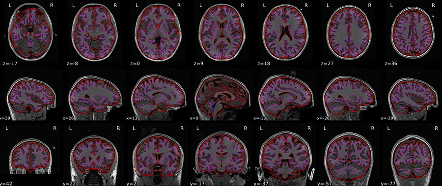

The red line is outlining the brain and the purple line is outlining white matter. No brain regions are excluded and the outline does not extend into the skull.

### Common Issues

#### Under-inclusive segmentation

Major parts of the brain are excluded from the segmentation. **→ FAIL**

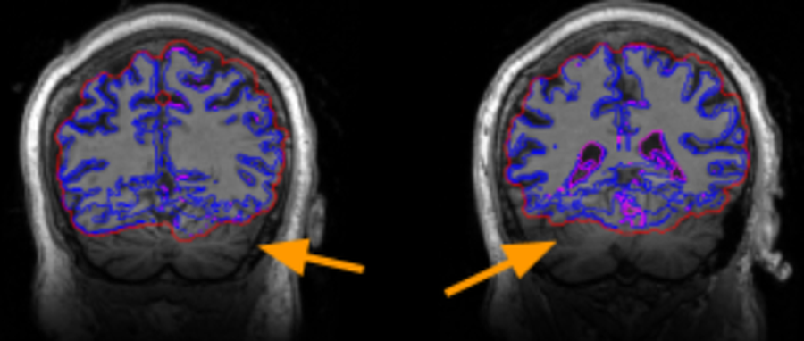

The cerebellum is excluded here.

#### Background artifact

Shadows around the outside of the brain. Usually **PASS** if it stays in the background and does not affect the brain image.

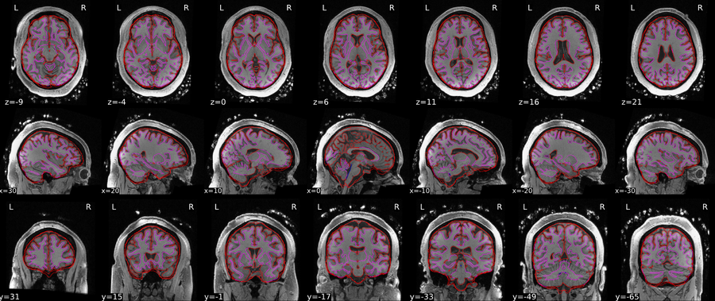

## T1 to MNI Coregistration (`t1_2_mni_qc`)

T1 to MNI Coregistration checks whether the participant's anatomical image aligns correctly with the MNI template. The main goal is to ensure that the anatomical structures overlap correctly without distortion or stretching.

### What to Check

- Check that the anatomical image overlaps the MNI outline.
- Check that there is no major skull visible. Little skull visible at the outline is still acceptable.
- Check that the cerebellum is not stretched or distorted.

### Good Example

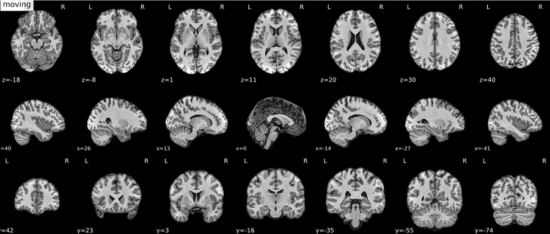

The outline overlaps perfectly. There is no skull visible and the cerebellum is not stretched.

### Common Issues

#### Cerebellum stretching

The cerebellum appears stretched or distorted. **→ FAIL**

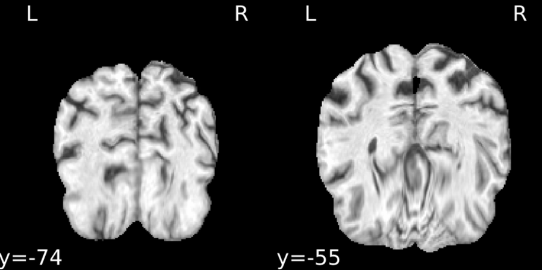

#### Skull visible

If major parts of the skull are visible, flag the scan. Minor skull outline at the edges can still **PASS**.

  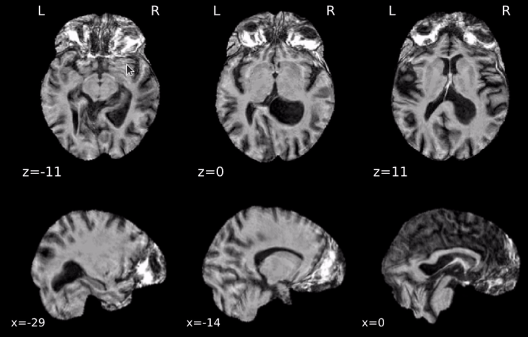
  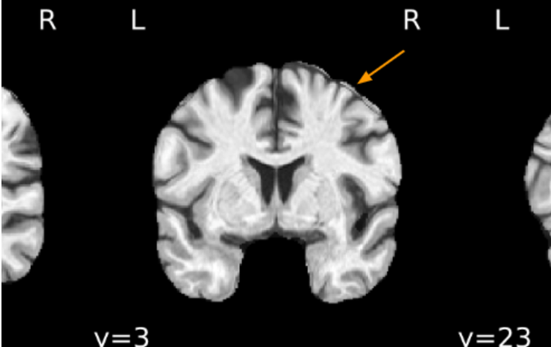

Major parts of the skull are visible in the left example. Minor outline of skull at the edges (right) can still pass.

## Susceptibility Distortion Correction (`sdc_wf_qc`)

Susceptibility Distortion Correction (SDC) checks whether distortion in the diffusion B0 image has been corrected properly. Compare the image before and after correction and decide whether the corrected image aligns better with the brain red outline.

### What the Red Outline Means

The red outline represents the reference anatomical/brain boundary used to judge alignment. Some parts may look incomplete because of weak signal or signal loss, especially in medial regions. This can still pass if the correction works overall.

### What to Check

- Check that the participant image includes the brain only and does not include major non-brain structures such as the skull or spinal cord.
- Compare Before and After SDC images. The corrected image should move closer to the red outline.
- If correction is very small, this can still pass as long as After is not worse than Before.
- Always check all axes as a whole before deciding.

### Good Example

   
  

The corrected version moves closer to the red outline.

### Common Issues

#### Miscorrection

The corrected version moves away from the red outline and the brain gets more distorted. **→ FAIL**

   
  

#### Signal dropout

Dark or missing regions. Can **PASS** in expected areas (temporal lobe, midbrain, orbitofrontal). **FAIL** only if severe and affecting major brain coverage.

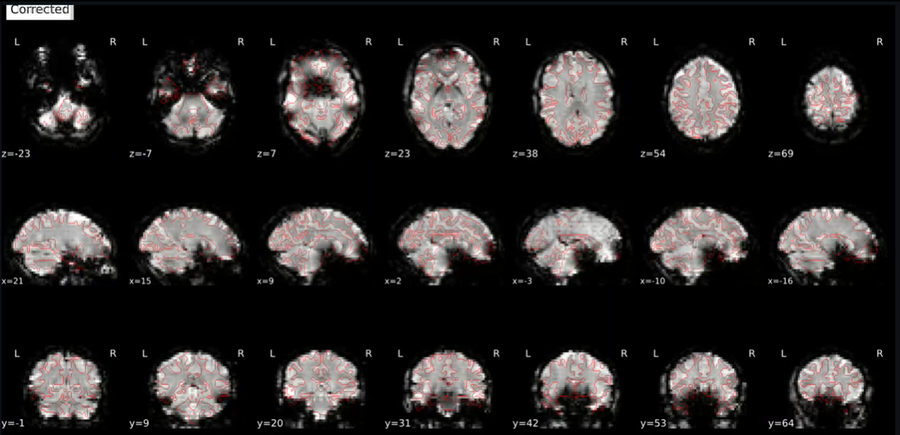

#### Frontal and temporal lobe distortion

Some scans appear distorted in frontal or temporal lobe even after correction. Can still **PASS**.

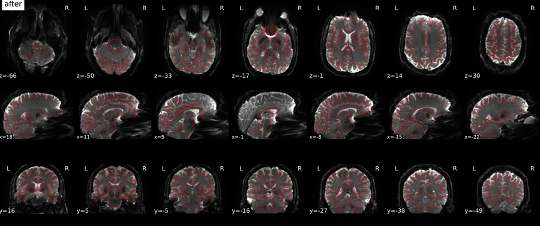

## B0 to T1 Coregistration (`coreg_wf_qc`)

B0 to T1 Coregistration checks whether the diffusion B0 image aligns correctly with the participant's anatomical T1 image. The main goal is to ensure that the outlines overlap correctly without shifts, rotations, or mismatches.

### What to Check

- Check that the B0 image overlaps the T1 outline. There is no shift or rotation in the images.
- Check for clipping at the bottom or top. If major parts of the cortex are clipped, flag the scan.

### Good Example

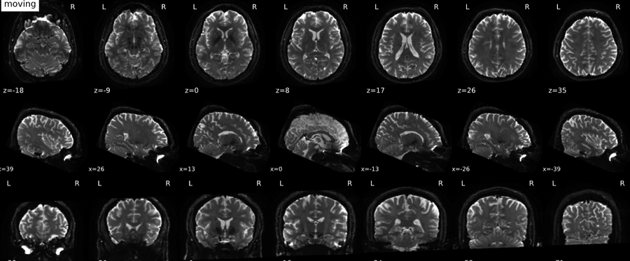

The B0 and T1 outlines match and there is no major clipping.

### Common Issues

#### Misalignment of B0 and T1 images

Visible as a clear rotation or shift.

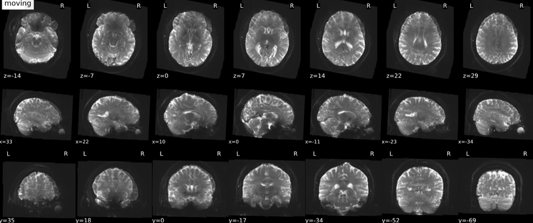

#### Frontal lobe distortion

On the x-axis, frontal lobe distortion is common and can still **PASS**.

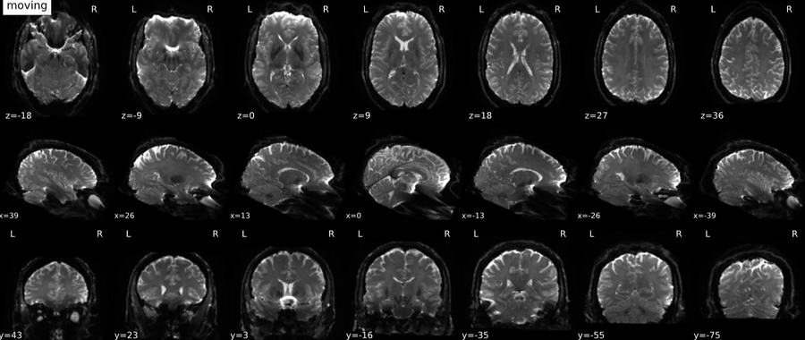

#### Clipping

Cerebellum clipping is common and can **PASS**. Major cortical clipping should be flagged and may **FAIL**.

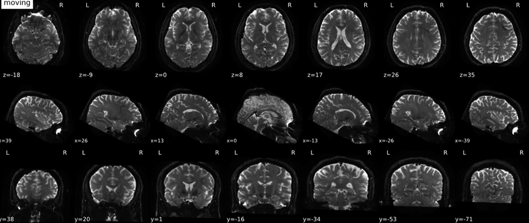

The cerebellum is clipped at the bottom. This can still pass.
