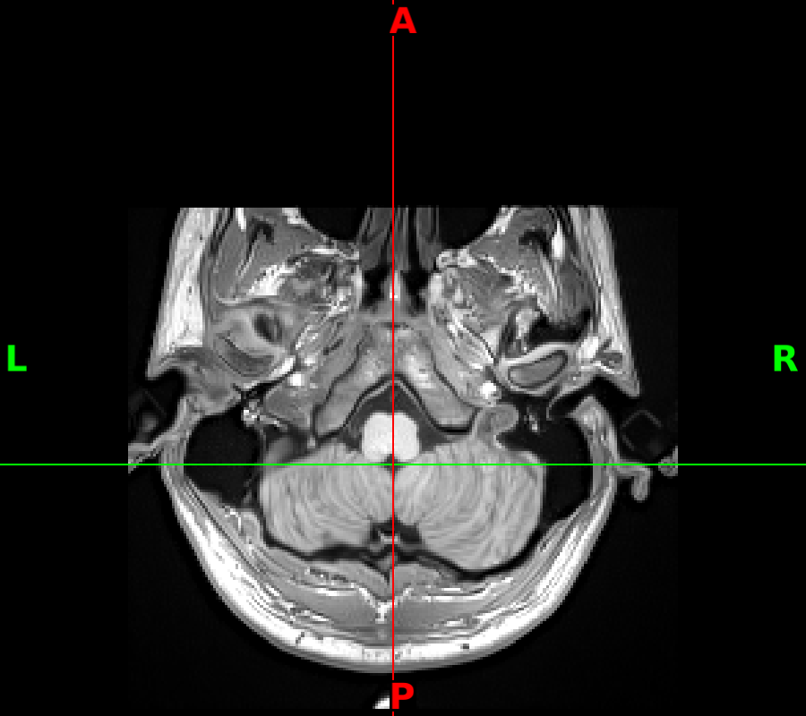
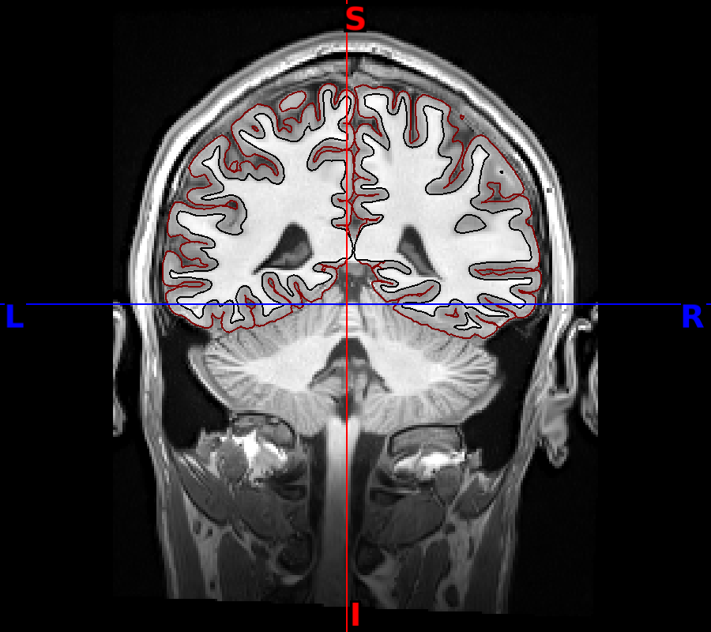
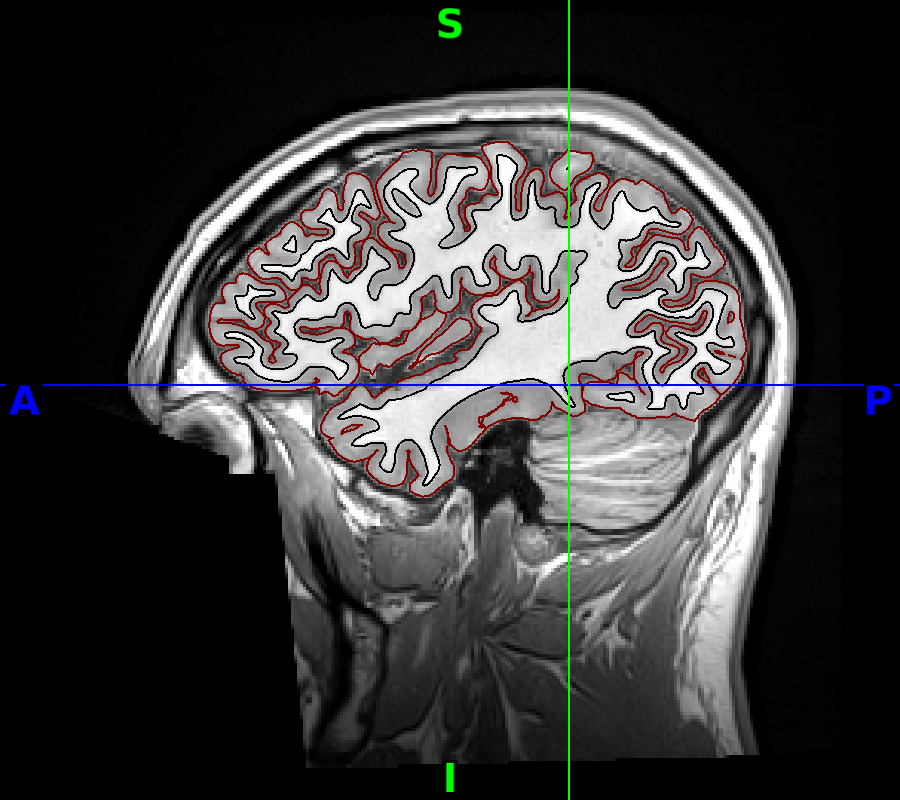
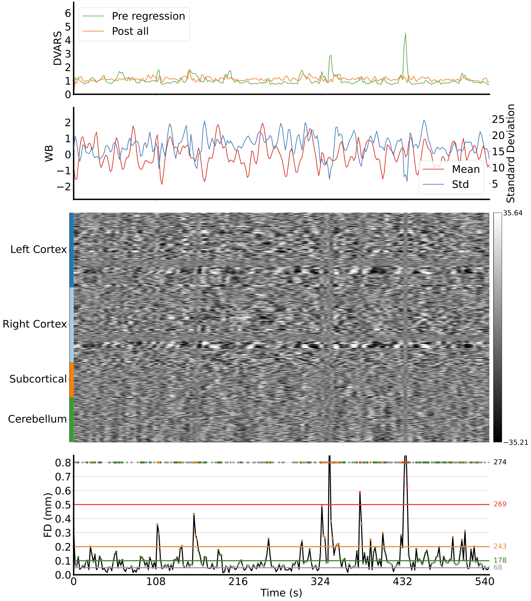

# XCP-D QC

**Location (repo sample):** `sample_data/xcpd/<subject>/figures/`. In production, point `--dataset_dir` at your XCP-D share (`data/share/xcp_d/0.7.3`, same flat layout per subject).

**In QC-Studio:** `atlas_coverage_qc`, `coreg_wf_qc`, `denoised_bold_qc`.

## Purpose and Scope

This QC protocol ensures that all XCP-D outputs meet quality standards before downstream analysis. It is intended for users who have run XCP-D on fMRI data preprocessed with fMRIPrep, HCP pipelines, or ABCD-BIDS. The QC should be completed after each dataset run, before statistical analysis begins.

XCP-D automatically generates denoised BOLD images, parcellated time series, and quality assessment (QA) reports. It uses the Brain Imaging Data Structure (BIDS) naming convention. More details can be found [here](https://xcp-d.readthedocs.io/).

## Getting Started with the Interface

Before starting QC, make sure XCP-D has successfully run for the subject or session. The output folder should contain XCP-D derivatives and visual reports for each participant.

Open the subject/session in the Streamlit QC app and review the available QC panels.

For **`atlas_coverage_qc`**, review the T1 atlas montages (axial, coronal, sagittal) to confirm parcellation coverage across the brain.

For **`coreg_wf_qc`**, check whether the functional image aligns properly with the T1w anatomical image, especially around brain boundaries, ventricles, sulci, and major structures.

For **`denoised_bold_qc`**, compare pre- and post-processing ESQC plots. Check DVARS, DVARS–FD correlation, and whether the whole-brain time series is smoother after denoising.

If the scan clearly meets the pass criteria, mark it as **PASS**. If it clearly meets the fail criteria, mark it as **FAIL**. If the case is uncertain or borderline, mark it as **UNCERTAIN** for supervisor review.

## Atlas Coverage (`atlas_coverage_qc`)

Atlas coverage checks whether the parcellation atlas was applied correctly across major brain regions. Review the axial, coronal, and sagittal T1 montages for complete, plausible atlas coverage.

> **Note (XCP-D 0.7.3):** There is a known bug in XCP-D 0.7.3 where the `atlas_coverage_qc` montages (axial, coronal, and sagittal `*_T1w.png` figures from `svg_montage_path`) may appear misaligned. This is a display issue in XCP-D and does not necessarily indicate a real registration failure. If fMRIPrep QC is acceptable—including functional-to-T1w alignment in `coreg_wf_qc`—you may still **PASS** atlas coverage.

### What to Check

- Review all nine T1 montages (three axial, three coronal, three sagittal).
- Check that atlas parcellation boundaries are visible and follow plausible anatomy in each view.
- Check that major brain regions are represented across views, without large gaps or missing coverage.

| | Criteria |
|---|---|
| **Pass** | Atlas boundaries visible on all montages; coverage looks complete across the brain; no obvious misregistration of atlas to anatomy |
| **Uncertain** | — |
| **Fail** | Large missing regions; atlas clearly misaligned with anatomy; parcellation appears absent or failed on multiple views |

**Action if Fail:**
- Verify the correct atlas was specified in XCP-D
- Check T1w preprocessing and normalization inputs
- Re-run XCP-D with the intended atlas configuration

### Good Example

Atlas coverage across the brain on axial, coronal, and sagittal T1 montages:

| | | |
|---|---|---|
|  |  |  |
|  |  |  |
|  |  |  |

## Functional-to-T1w Alignment (`coreg_wf_qc`)

Functional-to-T1w alignment checks whether the BOLD image aligns with the high-resolution T1w anatomical reference after bbregister.

### What to Check

- Does the functional image (usually fuzzier, lower contrast) align with the T1w image (high-resolution anatomical)?
- Are the brain boundaries, ventricles, and major structures aligned?

| | Criteria |
|---|---|
| **Pass** | Functional image fits inside the skull; sulci and ventricles match between the two images |
| **Uncertain** | — |
| **Fail** | Functional brain is shifted, rotated, or outside the skull boundaries; clear mismatch in shape or size |

**Action if Fail:**
- Re-run registration (bbregister) with alternative parameters
- Check T1w and functional image quality/orientation
- Verify correct anatomical reference was used

### Good Example

## Denoised BOLD QC (`denoised_bold_qc`)

Denoised BOLD QC uses the ESQC report to judge whether nuisance regression improved data quality. Compare pre- and post-processing plots for DVARS, DVARS–FD correlation, and the whole-brain time series (carpet plot).

### What to Check

- Check if DVARS value is decreased after post-processing.
- Check if DVARS–FD correlation is decreased after post-processing. The post-processing should always be lower than pre.
- Post-processing DVARS should have fewer spikes.
- Post-processing whole-brain time series should appear smoother.
- Motion (third) plot should look smoother and more consistent as opposed to the pre-processing plot — you should no longer see the noisy bands.

| | Criteria |
|---|---|
| **Pass** | DVARS lower post-processing (slightly higher is acceptable in rare cases); DVARS–FD correlation is lower post-processing; post-processing series clearly smoother with reduced noise |
| **Uncertain** | — |
| **Fail** | DVARS much higher after processing; DVARS–FD correlation increased post-processing; no improvement in smoothness or DVARS spikes remain high |

**Action if Fail:**
- Check motion regressors in XCP-D output
- Re-run with alternative nuisance regression settings
- Verify correct confounds were selected
- Review nuisance regressors used in denoising
- Test alternative regression model
- Re-run XCP-D with adjusted parameters

### Good Example

| Pre-processing | Post-processing |
|---|---|
|  |  |
